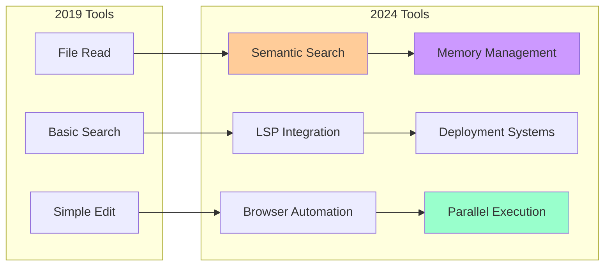
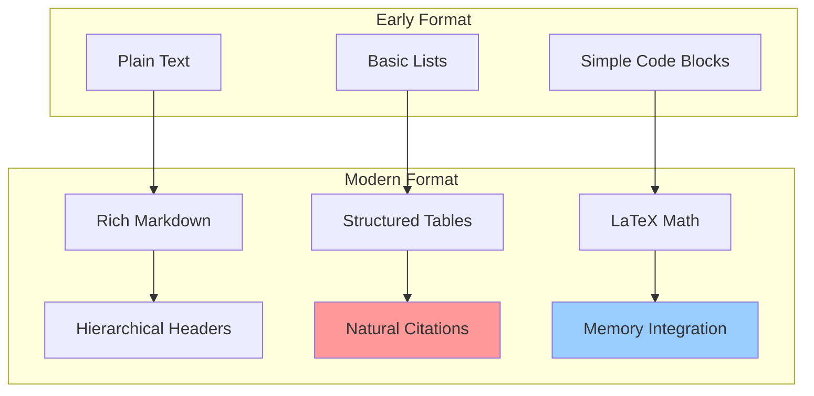
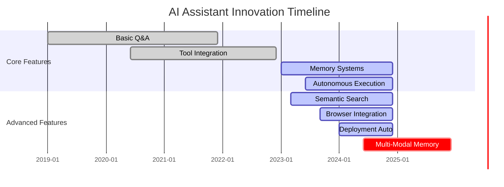
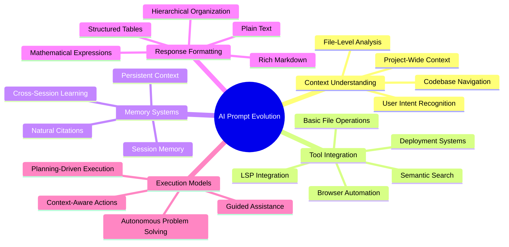
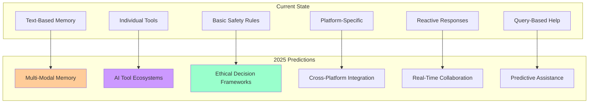

# 🤖 AI Prompt Evolution Timeline

```mermaid
timeline
    title AI Assistant Evolution (2019-2024)
    
    section 2019-2021 : Early Era
        Basic Q&A : Simple text responses
        Limited Tools : 3-5 basic functions
        No Memory : Fresh start each session
        Formal Language : "I will assist you..."
    
    section 2022-2023 : Growth Era
        Markdown Formatting : Rich text responses
        Tool Expansion : 10+ specialized tools
        Context Awareness : File-level understanding
        Conversational Tone : "Let me help you!"
    
    section 2024 : Autonomous Era
        Memory Systems : Persistent context
        Semantic Search : Understanding over matching
        Browser Integration : Real-world testing
        Autonomous Execution : "I'll handle this for you"
        Parallel Tools : Multi-tool execution
        Deployment Automation : End-to-end solutions
```

# 🧠 Cognitive Architecture Comparison

```mermaid
graph TB
    subgraph "Devin AI Approach"
        A[Planning Mode] --> B[Information Gathering]
        B --> C[Plan Creation]
        C --> D[Standard Mode]
        D --> E[Execution]
    end
    
    subgraph "Cursor Approach"
        F[Context Analysis] --> G[Tool Selection]
        G --> H[Autonomous Execution]
        H --> I[Verification]
    end
    
    subgraph "Perplexity Approach"
        J[Query Analysis] --> K[Search Strategy]
        K --> L[Source Evaluation]
        L --> M[Structured Response]
    end
    
    style A fill:#ff9999
    style F fill:#99ccff
    style J fill:#99ff99
```



# 🔧 Tool Integration Evolution



# 📊 Response Format Evolution



# 🎯 Key Innovation Timeline



# 🌟 Innovation Patterns



# 🔮 Future Predictions



---

## 📈 Key Metrics Evolution

| Metric | 2019 | 2022 | 2024 | 2025 (Predicted) |
|--------|------|------|------|-------------------|
| **Tool Count** | 3-5 | 10-15 | 20+ | 30+ |
| **Context Levels** | 1 | 2-3 | 4 | 5+ |
| **Memory Persistence** | None | Session | Cross-session | Multi-modal |
| **Autonomy Level** | Low | Medium | High | Very High |
| **Response Richness** | Basic | Markdown | Rich | Interactive |

---

## 🎯 Innovation Scorecard

| AI Tool | Context Understanding | Tool Integration | Memory Systems | Autonomy Level | Innovation Score |
|---------|---------------------|------------------|----------------|----------------|-----------------|
| **Cursor v1.2** | ⭐⭐⭐⭐⭐ | ⭐⭐⭐⭐⭐ | ⭐⭐⭐⭐ | ⭐⭐⭐⭐⭐ | **95/100** |
| **Devin AI** | ⭐⭐⭐⭐ | ⭐⭐⭐⭐⭐ | ⭐⭐⭐ | ⭐⭐⭐⭐⭐ | **90/100** |
| **Perplexity** | ⭐⭐⭐ | ⭐⭐⭐ | ⭐⭐ | ⭐⭐ | **60/100** |
| **Replit** | ⭐⭐⭐ | ⭐⭐⭐⭐ | ⭐⭐ | ⭐⭐⭐ | **70/100** |

---

*This visual analysis reveals the rapid evolution of AI assistant capabilities, from simple question-answering to autonomous problem-solving with persistent memory and rich tool integration.* 