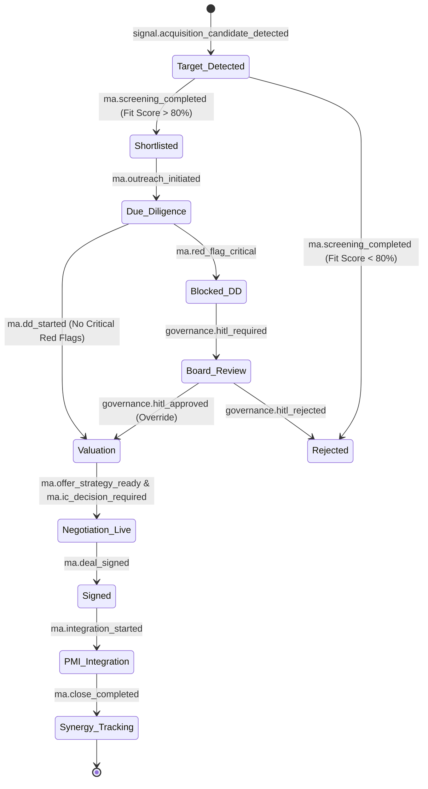

# Dealix Sovereign Growth OS: Master Architecture Pack

يمثل هذا المستند البنية الهندسية (Architecture Backbone) لتحويل Dealix من "نظام أتمتة مبيعات" إلى "نظام تشغيل نمو سيادي" (Level 5 Autonomy for Holding & Enterprise Scaling).

**فهرس Tier-1 (إنجليزي، يحدّث مع المستودع):** [`docs/blueprint-master-architecture.md`](docs/blueprint-master-architecture.md) — يربط المسارات الستة، الطائرات، مصفوفة التنفيذ، وحوكمة التسليم. **المسارات التشغيلية الستة:** [`docs/dealix-six-tracks.md`](docs/dealix-six-tracks.md). **طبقة التنفيذ الحتمية (حالي مقابل Temporal):** [`docs/governance/execution-fabric.md`](docs/governance/execution-fabric.md).

---

## 1. 🗺️ خريطة الخدمات (Service Map)

النظام مقسم إلى 8 طبقات تشغيلية لضمان عدم حدوث تداخلات أو اتخاذ قرارات بدون رقابة.

### الأجزاء والعناصر

1. **Signal Intelligence Layer (طبقة الاستشعار)**
   - `Market Signal Ingestor`: ويب سكرابر + News APIs للقطاعات.
   - `CRM/ERP Webhooks`: مراقبة الحالة (Pipeline, Billing).
2. **Knowledge & Memory Layer (طبقة المعرفة)**
   - `Vector Store (Pinecone/Milvus)`: تخزين تاريخ المفاوضات والعقود والمذكرات.
   - `Redis Store`: حالة العمليات (State Machine Status).
3. **Reasoning & Prioritization Engine (طبقة اتخاذ القرار)**
   - `Agent Executor / LLM Gateway`: (محرك التنفيذ المركزي للـ 16 وكيلًا).
   - `Scoring Engine`: لتقييم المزايا المالية لكل خطوة استراتيجية.
4. **Workflow Orchestration (طبقة ضبط المسارات)**
   - `LangGraph / Celery Orchestrator`: للـ Long-running workflows (كالفحص النافي للجهالة الذي يطول أسابيع).
   - `Event Bus (Kafka/RabbitMQ)`: لمعالجة الأحداث (Event Taxonomy 2.0).
5. **Policy & Governance Layer (طبقة الحوكمة)**
   - `Policy-as-Code Engine`: يقوم بإغلاق أو تمرير التنفيذات بناءً على الموافقات والمخاطر.
6. **Execution Action Layer (طبقة الأفعال)**
   - `Dispatcher`: WhatsApp, Email, DocGen (للعقود والأوراق)، ERP/CRM Integrations.
7. **Analytics & Learning Loop (طبقة التعلم)**
   - `Forecast vs Actual Model`: لمقارنة توقعات الذكاء (مثلاً: أرباح الشراكة) مع الأرقام الفعلية بالمحاسبة، لتصحيح النماذج التنبؤية.
8. **Executive Cockpit (لوحة الإدارة العليا)**
   - واجهة Board Members (مذكرات، Heatmaps، تصعيد).

---

## 2. 📊 مخطط الأحداث ومكائن الحالة (State & Event Diagrams)

تتغير حالة الكيان من خلال أحداث مسجلة في (Event Bus) يقرأها النظام عبر `router.py`. 

### State Machine: M&A Lifecycle (مثال)

---

## 3. 🗄️ نموذج البيانات (Data Model - Entity Graph)

يتم ربط كل عنصرในDealix برسم بياني (Graph) لمنع تبعثر المعرفة:

- **Entity Model (الكيان)**: (مثل 회사 "ألف") يمكن أن يكون في نفس الوقت (شريك محتمل) أو (هدف استحواذ) أو (عميل).
- **Initiative Model (المبادرات)**: يربط الخطط التنفيذية المتفرعة من M&A أو التوسع بالـ (Tasks).
- **Decision Memo Model (מذكرات القرار)**: الكيان الأهم ويحتفظ بـ:
  - `memo_id`
  - `agent_id`
  - `decision_context`
  - `financial_impact_sar`
  - `audit_trail_hash`
  - `status` (pending, approved, executed, rejected, rolled-back).

---

## 4. 🔏 مصفوفة الصلاحيات والموافقات (Approval & Governance Matrix)

لا توجد قرارات "صامتة" في مستوى السيادة.

| فئة القرار (Decision Class) | وكيل التوصية (Agent) | محرك السياسة (Policy Check) | موافقة (HITL Gate) | المسار حال الرفض (Rollback) |
| :--- | :--- | :--- | :--- | :--- |
| **دخول سوق جديد** | Expansion Playbook | PDPL compliance, Legal checks | **CEO & Board** | حفظ التقرير + وقف الصرف المالي |
| **استحواذ > 1 مليون ريال** | Valuation & Synergy | Budget Validation, Due Diligence OK | **Board of Directors** | إعادة تقييم السعر / إلغاء التفاوض |
| **حملة تسويق آلي C-Level** | Exec. Outreach | Frequency Cap (لا تزعج CEO مرتين) | **VP Sales** | تغيير التوقيت / الصياغة |
| **هيكلة شراكة مع منافس** | Alliance Structuring | Anti-monopoly risk | **CEO + Legal** | استبعاد الشراكة / تغيير الهيكل لـ Referral |

---

## 5. 🚀 مراحل التنفيذ المعماري (Implementation Phases)

### ✅ Phase 1: Operating Backbone (الأيام 0 - 30)
**الهدف**: تأسيس أساس الـ OS الذي ستبنى عليه كل الوكلاء الجدد.
1. بناء `Decision Memo Engine` (الـ Standard Contract الجديد).
2. تطبيق الـ `Event Schema v2.0` داخل نظام التوجيه.
3. إنشاء `Policy-as-Code Engine` للموافقات (Approval Gates).
4. تفعيل أول 4 وكلاء (Strategic PMO, Lead Intel, Exec Outreach, Scout).

### ✅ Phase 2: Revenue & Alliance Flywheel (الأيام 30 - 60)
**الهدف**: تشغيل دورة الإيرادات والشراكات بشكل ذكي ومحوكم.
1. تفعيل وكلاء الشراكات (Alliance Structuring).
2. إطلاق `Partner ROI Model` لوزن أي شراكة فورياً.
3. إتمام الدائرة بين الـ Proposal Design ودفع العميل عبر CRM.

### ✅ Phase 3: Coporate Development & M&A (الأيام 60 - 90)
**الهدف**: تجهيز غرفة الإدارة الذكية للنمو غير العضوي (Inorganic Growth).
1. بناء وإطلاق وكلاء الـ M&A (Screener, DD Analyst, Valuation).
2. تفعيل غرفة اتخاذ القرار الافتراضية (Decision Room) للـ Board.
3. تفعيل الـ PMI Engine لضمان الدمج العضوي بعد الصفقة.

### ✅ Phase 4: Sovereign Scale (الأيام 90 - 120)
**الهدف**: رؤية סיادية للمجموعة وإدارة المحفظة واستدراك الأخطاء.
1. تفعيل العميل الأعلى **Sovereign Intelligence Agent**.
2. تفعيل نظام `Forecast Vs. Actual` للتعلم الآلي (Self-Correction Loop).
3. إطلاق ميزة الـ Portfolio Dashboard لكافة مجموعة الأعمال (Holding Level).
