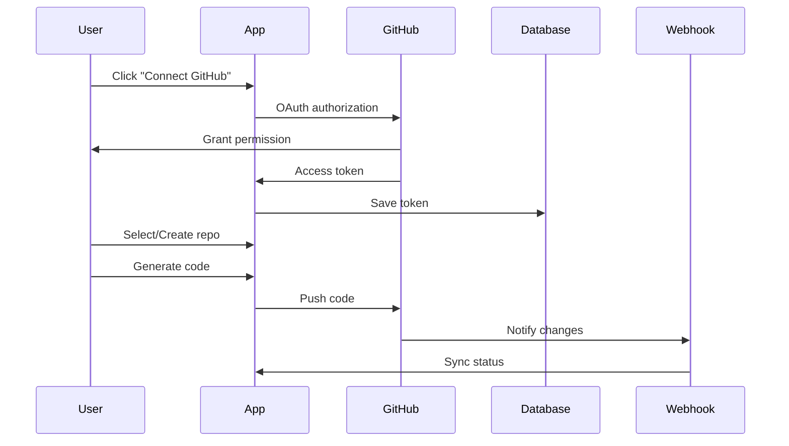

# 🚀 Lovable Clone - GitHub Integration & Pricing Plans

> Complete guide để tích hợp GitHub và thiết kế subscription model

---

# 📑 Table of Contents

1. [GitHub Integration Overview](#github-integration-overview)
2. [GitHub OAuth Setup](#github-oauth-setup)
3. [Repository Management](#repository-management)
4. [Push Code to GitHub](#push-code-to-github)
5. [Webhook Integration](#webhook-integration)
6. [Pricing Plans Design](#pricing-plans-design)
7. [Stripe Integration](#stripe-integration)
8. [Feature Gating](#feature-gating)
9. [Usage Tracking & Quotas](#usage-tracking--quotas)
10. [Admin Dashboard](#admin-dashboard)

---

# 🔗 I. GITHUB INTEGRATION OVERVIEW

## Features

### Core Functionality
- ✅ Connect GitHub account via OAuth
- ✅ List user's repositories
- ✅ Create new repository from app
- ✅ Push generated code to GitHub
- ✅ Auto-commit với AI-generated messages
- ✅ Branch management
- ✅ Pull request creation
- ✅ Webhook for 2-way sync

### User Flow



---

# 🔐 II. GITHUB OAUTH SETUP

## 1. Create GitHub OAuth App

**File: `.env.local`**

```env
# GitHub OAuth
GITHUB_CLIENT_ID=Iv1.your_client_id
GITHUB_CLIENT_SECRET=your_client_secret
GITHUB_REDIRECT_URI=http://localhost:3000/api/auth/github/callback

# Production
NEXT_PUBLIC_APP_URL=https://yourdomain.com
```

## 2. Database Schema

**File: `supabase/migrations/20240115000000_github_integration.sql`**

```sql
-- GitHub connections table
CREATE TABLE public.github_connections (
  id uuid default uuid_generate_v4() primary key,
  user_id uuid references public.profiles(id) on delete cascade not null,
  github_user_id text not null,
  github_username text not null,
  access_token text not null, -- Encrypted
  refresh_token text,
  token_expires_at timestamptz,
  scopes text[] not null,
  avatar_url text,
  created_at timestamptz default now(),
  updated_at timestamptz default now(),

  unique(user_id)
);

-- GitHub repositories table
CREATE TABLE public.github_repositories (
  id uuid default uuid_generate_v4() primary key,
  project_id uuid references public.projects(id) on delete cascade not null,
  github_connection_id uuid references public.github_connections(id) on delete cascade not null,
  repo_id bigint not null,
  repo_name text not null,
  repo_full_name text not null,
  repo_url text not null,
  default_branch text default 'main',
  is_private boolean default true,
  last_push_at timestamptz,
  created_at timestamptz default now(),

  unique(project_id)
);

-- Sync history
CREATE TABLE public.github_sync_history (
  id uuid default uuid_generate_v4() primary key,
  github_repository_id uuid references public.github_repositories(id) on delete cascade not null,
  commit_sha text not null,
  commit_message text not null,
  files_changed integer not null,
  status text not null, -- 'success' | 'failed' | 'pending'
  error_message text,
  created_at timestamptz default now()
);

-- Indexes
CREATE INDEX idx_github_connections_user_id ON public.github_connections(user_id);
CREATE INDEX idx_github_repositories_project_id ON public.github_repositories(project_id);
CREATE INDEX idx_github_sync_history_repo_id ON public.github_sync_history(github_repository_id);

-- RLS Policies
ALTER TABLE public.github_connections ENABLE ROW LEVEL SECURITY;
ALTER TABLE public.github_repositories ENABLE ROW LEVEL SECURITY;
ALTER TABLE public.github_sync_history ENABLE ROW LEVEL SECURITY;

CREATE POLICY "Users can manage own GitHub connections"
  ON public.github_connections FOR ALL
  USING (auth.uid() = user_id);

CREATE POLICY "Users can manage own repositories"
  ON public.github_repositories FOR ALL
  USING (
    EXISTS (
      SELECT 1 FROM public.projects p
      WHERE p.id = github_repositories.project_id
      AND p.user_id = auth.uid()
    )
  );

CREATE POLICY "Users can view own sync history"
  ON public.github_sync_history FOR SELECT
  USING (
    EXISTS (
      SELECT 1 FROM public.github_repositories gr
      JOIN public.projects p ON p.id = gr.project_id
      WHERE gr.id = github_sync_history.github_repository_id
      AND p.user_id = auth.uid()
    )
  );
```

## 3. GitHub OAuth Flow

**File: `src/lib/github/oauth.ts`**

```typescript
import { createClient } from '@/lib/supabase/server';
import { encrypt, decrypt } from '@/lib/crypto';

interface GitHubUser {
  id: number;
  login: string;
  avatar_url: string;
  name: string;
  email: string;
}

interface GitHubTokenResponse {
  access_token: string;
  token_type: string;
  scope: string;
  refresh_token?: string;
  expires_in?: number;
}

export class GitHubOAuth {
  private clientId: string;
  private clientSecret: string;
  private redirectUri: string;

  constructor() {
    this.clientId = process.env.GITHUB_CLIENT_ID!;
    this.clientSecret = process.env.GITHUB_CLIENT_SECRET!;
    this.redirectUri = process.env.GITHUB_REDIRECT_URI!;
  }

  /**
   * Get authorization URL
   */
  getAuthorizationUrl(state: string): string {
    const params = new URLSearchParams({
      client_id: this.clientId,
      redirect_uri: this.redirectUri,
      scope: 'repo,user:email,workflow',
      state,
      allow_signup: 'true'
    });

    return `https://github.com/login/oauth/authorize?${params.toString()}`;
  }

  /**
   * Exchange code for access token
   */
  async exchangeCodeForToken(code: string): Promise<GitHubTokenResponse> {
    const response = await fetch('https://github.com/login/oauth/access_token', {
      method: 'POST',
      headers: {
        'Content-Type': 'application/json',
        'Accept': 'application/json'
      },
      body: JSON.stringify({
        client_id: this.clientId,
        client_secret: this.clientSecret,
        code,
        redirect_uri: this.redirectUri
      })
    });

    if (!response.ok) {
      throw new Error('Failed to exchange code for token');
    }

    return response.json();
  }

  /**
   * Get GitHub user info
   */
  async getUserInfo(accessToken: string): Promise<GitHubUser> {
    const response = await fetch('https://api.github.com/user', {
      headers: {
        'Authorization': `Bearer ${accessToken}`,
        'Accept': 'application/vnd.github.v3+json'
      }
    });

    if (!response.ok) {
      throw new Error('Failed to get user info');
    }

    return response.json();
  }

  /**
   * Save GitHub connection to database
   */
  async saveConnection(
    userId: string,
    tokenData: GitHubTokenResponse,
    userData: GitHubUser
  ): Promise<void> {
    const supabase = createClient();

    // Encrypt access token
    const encryptedToken = await encrypt(tokenData.access_token);

    const expiresAt = tokenData.expires_in
      ? new Date(Date.now() + tokenData.expires_in * 1000)
      : null;

    await supabase
      .from('github_connections')
      .upsert({
        user_id: userId,
        github_user_id: userData.id.toString(),
        github_username: userData.login,
        access_token: encryptedToken,
        refresh_token: tokenData.refresh_token,
        token_expires_at: expiresAt?.toISOString(),
        scopes: tokenData.scope.split(','),
        avatar_url: userData.avatar_url,
        updated_at: new Date().toISOString()
      });
  }

  /**
   * Get user's GitHub connection
   */
  async getConnection(userId: string) {
    const supabase = createClient();

    const { data, error } = await supabase
      .from('github_connections')
      .select('*')
      .eq('user_id', userId)
      .single();

    if (error || !data) {
      return null;
    }

    // Decrypt access token
    const accessToken = await decrypt(data.access_token);

    return {
      ...data,
      access_token: accessToken
    };
  }
}
```

## 4. OAuth API Routes

**File: `src/app/api/auth/github/route.ts`**

```typescript
import { NextRequest, NextResponse } from 'next/server';
import { createClient } from '@/lib/supabase/server';
import { GitHubOAuth } from '@/lib/github/oauth';
import { nanoid } from 'nanoid';

export async function GET(request: NextRequest) {
  const supabase = createClient();

  // Check if user is authenticated
  const { data: { user } } = await supabase.auth.getUser();
  if (!user) {
    return NextResponse.redirect(new URL('/login', request.url));
  }

  // Generate state for CSRF protection
  const state = nanoid();

  // Store state in session
  const response = NextResponse.redirect(
    new GitHubOAuth().getAuthorizationUrl(state)
  );

  response.cookies.set('github_oauth_state', state, {
    httpOnly: true,
    secure: process.env.NODE_ENV === 'production',
    sameSite: 'lax',
    maxAge: 600 // 10 minutes
  });

  return response;
}
```

**File: `src/app/api/auth/github/callback/route.ts`**

```typescript
import { NextRequest, NextResponse } from 'next/server';
import { createClient } from '@/lib/supabase/server';
import { GitHubOAuth } from '@/lib/github/oauth';

export async function GET(request: NextRequest) {
  const searchParams = request.nextUrl.searchParams;
  const code = searchParams.get('code');
  const state = searchParams.get('state');
  const storedState = request.cookies.get('github_oauth_state')?.value;

  // Verify state
  if (!state || !storedState || state !== storedState) {
    return NextResponse.redirect(
      new URL('/dashboard?error=invalid_state', request.url)
    );
  }

  if (!code) {
    return NextResponse.redirect(
      new URL('/dashboard?error=no_code', request.url)
    );
  }

  try {
    const supabase = createClient();
    const { data: { user } } = await supabase.auth.getUser();

    if (!user) {
      return NextResponse.redirect(new URL('/login', request.url));
    }

    const github = new GitHubOAuth();

    // Exchange code for token
    const tokenData = await github.exchangeCodeForToken(code);

    // Get user info
    const userData = await github.getUserInfo(tokenData.access_token);

    // Save connection
    await github.saveConnection(user.id, tokenData, userData);

    // Redirect to dashboard
    const response = NextResponse.redirect(
      new URL('/dashboard?github=connected', request.url)
    );

    // Clear state cookie
    response.cookies.delete('github_oauth_state');

    return response;

  } catch (error) {
    console.error('GitHub OAuth error:', error);
    return NextResponse.redirect(
      new URL('/dashboard?error=github_auth_failed', request.url)
    );
  }
}
```

---

# 📁 III. REPOSITORY MANAGEMENT

## 1. GitHub API Client

**File: `src/lib/github/client.ts`**

```typescript
import { Octokit } from '@octokit/rest';

export interface GitHubRepository {
  id: number;
  name: string;
  full_name: string;
  private: boolean;
  html_url: string;
  default_branch: string;
  description: string | null;
}

export class GitHubClient {
  private octokit: Octokit;

  constructor(accessToken: string) {
    this.octokit = new Octokit({
      auth: accessToken
    });
  }

  /**
   * List user's repositories
   */
  async listRepositories(
    options: {
      type?: 'all' | 'owner' | 'member';
      sort?: 'created' | 'updated' | 'pushed' | 'full_name';
      per_page?: number;
    } = {}
  ): Promise<GitHubRepository[]> {
    const { data } = await this.octokit.repos.listForAuthenticatedUser({
      type: options.type || 'owner',
      sort: options.sort || 'updated',
      per_page: options.per_page || 100
    });

    return data;
  }

  /**
   * Create a new repository
   */
  async createRepository(options: {
    name: string;
    description?: string;
    private?: boolean;
    auto_init?: boolean;
  }): Promise<GitHubRepository> {
    const { data } = await this.octokit.repos.createForAuthenticatedUser({
      name: options.name,
      description: options.description || 'Created with Lovable Clone',
      private: options.private ?? true,
      auto_init: options.auto_init ?? true
    });

    return data;
  }

  /**
   * Get repository
   */
  async getRepository(owner: string, repo: string): Promise<GitHubRepository> {
    const { data } = await this.octokit.repos.get({
      owner,
      repo
    });

    return data;
  }

  /**
   * Create or update file
   */
  async createOrUpdateFile(
    owner: string,
    repo: string,
    path: string,
    content: string,
    message: string,
    branch: string = 'main'
  ): Promise<void> {
    try {
      // Try to get existing file
      const { data: existingFile } = await this.octokit.repos.getContent({
        owner,
        repo,
        path,
        ref: branch
      });

      // Update existing file
      await this.octokit.repos.createOrUpdateFileContents({
        owner,
        repo,
        path,
        message,
        content: Buffer.from(content).toString('base64'),
        branch,
        sha: 'sha' in existingFile ? existingFile.sha : undefined
      });
    } catch (error: any) {
      if (error.status === 404) {
        // Create new file
        await this.octokit.repos.createOrUpdateFileContents({
          owner,
          repo,
          path,
          message,
          content: Buffer.from(content).toString('base64'),
          branch
        });
      } else {
        throw error;
      }
    }
  }

  /**
   * Create multiple files (batch)
   */
  async createTree(
    owner: string,
    repo: string,
    files: Array<{ path: string; content: string }>,
    branch: string = 'main'
  ): Promise<string> {
    // Get latest commit
    const { data: ref } = await this.octokit.git.getRef({
      owner,
      repo,
      ref: `heads/${branch}`
    });

    const latestCommitSha = ref.object.sha;

    // Create blobs for each file
    const blobs = await Promise.all(
      files.map(async (file) => {
        const { data } = await this.octokit.git.createBlob({
          owner,
          repo,
          content: Buffer.from(file.content).toString('base64'),
          encoding: 'base64'
        });
        return {
          path: file.path,
          mode: '100644' as const,
          type: 'blob' as const,
          sha: data.sha
        };
      })
    );

    // Create tree
    const { data: tree } = await this.octokit.git.createTree({
      owner,
      repo,
      base_tree: latestCommitSha,
      tree: blobs
    });

    return tree.sha;
  }

  /**
   * Create commit
   */
  async createCommit(
    owner: string,
    repo: string,
    message: string,
    treeSha: string,
    parentSha: string
  ): Promise<string> {
    const { data: commit } = await this.octokit.git.createCommit({
      owner,
      repo,
      message,
      tree: treeSha,
      parents: [parentSha]
    });

    return commit.sha;
  }

  /**
   * Update branch reference
   */
  async updateRef(
    owner: string,
    repo: string,
    branch: string,
    sha: string
  ): Promise<void> {
    await this.octokit.git.updateRef({
      owner,
      repo,
      ref: `heads/${branch}`,
      sha,
      force: false
    });
  }
}
```

## 2. Repository Management API

**File: `src/app/api/github/repositories/route.ts`**

```typescript
import { NextResponse } from 'next/server';
import { createClient } from '@/lib/supabase/server';
import { GitHubOAuth } from '@/lib/github/oauth';
import { GitHubClient } from '@/lib/github/client';

export async function GET() {
  const supabase = createClient();

  const { data: { user } } = await supabase.auth.getUser();
  if (!user) {
    return NextResponse.json({ error: 'Unauthorized' }, { status: 401 });
  }

  try {
    // Get GitHub connection
    const github = new GitHubOAuth();
    const connection = await github.getConnection(user.id);

    if (!connection) {
      return NextResponse.json(
        { error: 'GitHub not connected' },
        { status: 400 }
      );
    }

    // List repositories
    const client = new GitHubClient(connection.access_token);
    const repositories = await client.listRepositories();

    return NextResponse.json({ repositories });

  } catch (error: any) {
    console.error('Failed to list repositories:', error);
    return NextResponse.json(
      { error: 'Failed to list repositories' },
      { status: 500 }
    );
  }
}

export async function POST(request: Request) {
  const supabase = createClient();

  const { data: { user } } = await supabase.auth.getUser();
  if (!user) {
    return NextResponse.json({ error: 'Unauthorized' }, { status: 401 });
  }

  try {
    const { name, description, isPrivate, projectId } = await request.json();

    // Get GitHub connection
    const github = new GitHubOAuth();
    const connection = await github.getConnection(user.id);

    if (!connection) {
      return NextResponse.json(
        { error: 'GitHub not connected' },
        { status: 400 }
      );
    }

    // Create repository
    const client = new GitHubClient(connection.access_token);
    const repo = await client.createRepository({
      name,
      description,
      private: isPrivate,
      auto_init: true
    });

    // Save to database
    await supabase.from('github_repositories').insert({
      project_id: projectId,
      github_connection_id: connection.id,
      repo_id: repo.id,
      repo_name: repo.name,
      repo_full_name: repo.full_name,
      repo_url: repo.html_url,
      default_branch: repo.default_branch,
      is_private: repo.private
    });

    return NextResponse.json({ repository: repo });

  } catch (error: any) {
    console.error('Failed to create repository:', error);
    return NextResponse.json(
      { error: error.message || 'Failed to create repository' },
      { status: 500 }
    );
  }
}
```

---

# ⬆️ IV. PUSH CODE TO GITHUB

## 1. Push Service

**File: `src/lib/github/push-service.ts`**

```typescript
import { createClient } from '@/lib/supabase/server';
import { GitHubOAuth } from './oauth';
import { GitHubClient } from './client';

export interface PushOptions {
  projectId: string;
  userId: string;
  commitMessage?: string;
  branch?: string;
}

export class GitHubPushService {
  /**
   * Push project files to GitHub
   */
  async pushProject(options: PushOptions): Promise<{
    success: boolean;
    commitSha?: string;
    url?: string;
    error?: string;
  }> {
    const supabase = createClient();

    try {
      // 1. Get GitHub connection
      const github = new GitHubOAuth();
      const connection = await github.getConnection(options.userId);

      if (!connection) {
        return { success: false, error: 'GitHub not connected' };
      }

      // 2. Get GitHub repository
      const { data: githubRepo } = await supabase
        .from('github_repositories')
        .select('*')
        .eq('project_id', options.projectId)
        .single();

      if (!githubRepo) {
        return { success: false, error: 'Repository not linked' };
      }

      // 3. Get project files
      const { data: projectFiles } = await supabase
        .from('project_files')
        .select('*')
        .eq('project_id', options.projectId);

      if (!projectFiles || projectFiles.length === 0) {
        return { success: false, error: 'No files to push' };
      }

      // 4. Push files to GitHub
      const client = new GitHubClient(connection.access_token);
      const [owner, repo] = githubRepo.repo_full_name.split('/');
      const branch = options.branch || githubRepo.default_branch;

      // Get latest commit
      const { data: ref } = await client.octokit.git.getRef({
        owner,
        repo,
        ref: `heads/${branch}`
      });

      const latestCommitSha = ref.object.sha;

      // Create tree with all files
      const treeSha = await client.createTree(
        owner,
        repo,
        projectFiles.map(file => ({
          path: file.path,
          content: file.content
        })),
        branch
      );

      // Create commit
      const commitMessage = options.commitMessage || this.generateCommitMessage(projectFiles);
      const commitSha = await client.createCommit(
        owner,
        repo,
        commitMessage,
        treeSha,
        latestCommitSha
      );

      // Update branch
      await client.updateRef(owner, repo, branch, commitSha);

      // 5. Update sync history
      await supabase.from('github_sync_history').insert({
        github_repository_id: githubRepo.id,
        commit_sha: commitSha,
        commit_message: commitMessage,
        files_changed: projectFiles.length,
        status: 'success'
      });

      // 6. Update last push timestamp
      await supabase
        .from('github_repositories')
        .update({ last_push_at: new Date().toISOString() })
        .eq('id', githubRepo.id);

      return {
        success: true,
        commitSha,
        url: `${githubRepo.repo_url}/commit/${commitSha}`
      };

    } catch (error: any) {
      console.error('Push to GitHub failed:', error);

      // Log error to sync history
      const { data: githubRepo } = await supabase
        .from('github_repositories')
        .select('id')
        .eq('project_id', options.projectId)
        .single();

      if (githubRepo) {
        await supabase.from('github_sync_history').insert({
          github_repository_id: githubRepo.id,
          commit_sha: '',
          commit_message: options.commitMessage || '',
          files_changed: 0,
          status: 'failed',
          error_message: error.message
        });
      }

      return {
        success: false,
        error: error.message
      };
    }
  }

  /**
   * Generate AI commit message
   */
  private generateCommitMessage(files: any[]): string {
    // Simple commit message generation
    // TODO: Use AI to generate better commit messages
    const fileCount = files.length;
    const fileTypes = new Set(files.map(f => f.path.split('.').pop()));

    return `Update ${fileCount} file${fileCount > 1 ? 's' : ''} (${Array.from(fileTypes).join(', ')})`;
  }
}
```

## 2. Push API Route

**File: `src/app/api/github/push/route.ts`**

```typescript
import { NextResponse } from 'next/server';
import { createClient } from '@/lib/supabase/server';
import { GitHubPushService } from '@/lib/github/push-service';

export async function POST(request: Request) {
  const supabase = createClient();

  const { data: { user } } = await supabase.auth.getUser();
  if (!user) {
    return NextResponse.json({ error: 'Unauthorized' }, { status: 401 });
  }

  try {
    const { projectId, commitMessage, branch } = await request.json();

    if (!projectId) {
      return NextResponse.json(
        { error: 'Project ID is required' },
        { status: 400 }
      );
    }

    // Verify project ownership
    const { data: project } = await supabase
      .from('projects')
      .select('id')
      .eq('id', projectId)
      .eq('user_id', user.id)
      .single();

    if (!project) {
      return NextResponse.json(
        { error: 'Project not found' },
        { status: 404 }
      );
    }

    // Push to GitHub
    const pushService = new GitHubPushService();
    const result = await pushService.pushProject({
      projectId,
      userId: user.id,
      commitMessage,
      branch
    });

    if (!result.success) {
      return NextResponse.json(
        { error: result.error },
        { status: 500 }
      );
    }

    return NextResponse.json({
      success: true,
      commitSha: result.commitSha,
      url: result.url
    });

  } catch (error: any) {
    console.error('Push failed:', error);
    return NextResponse.json(
      { error: error.message || 'Push failed' },
      { status: 500 }
    );
  }
}
```

## 3. React Component

**File: `src/components/github/push-button.tsx`**

```typescript
'use client';

import { useState } from 'react';
import { Button } from '@/components/ui/button';
import {
  Dialog,
  DialogContent,
  DialogDescription,
  DialogHeader,
  DialogTitle,
  DialogTrigger
} from '@/components/ui/dialog';
import { Input } from '@/components/ui/input';
import { Label } from '@/components/ui/label';
import { GitBranch, Upload } from 'lucide-react';
import { toast } from 'sonner';

interface PushButtonProps {
  projectId: string;
  disabled?: boolean;
}

export function PushButton({ projectId, disabled }: PushButtonProps) {
  const [open, setOpen] = useState(false);
  const [pushing, setPushing] = useState(false);
  const [commitMessage, setCommitMessage] = useState('');
  const [branch, setBranch] = useState('main');

  async function handlePush() {
    if (!commitMessage.trim()) {
      toast.error('Please enter a commit message');
      return;
    }

    setPushing(true);

    try {
      const response = await fetch('/api/github/push', {
        method: 'POST',
        headers: { 'Content-Type': 'application/json' },
        body: JSON.stringify({
          projectId,
          commitMessage,
          branch
        })
      });

      const data = await response.json();

      if (!response.ok) {
        throw new Error(data.error || 'Push failed');
      }

      toast.success('Pushed to GitHub successfully!', {
        description: `View commit: ${data.url}`,
        action: {
          label: 'View',
          onClick: () => window.open(data.url, '_blank')
        }
      });

      setOpen(false);
      setCommitMessage('');

    } catch (error: any) {
      toast.error(error.message || 'Failed to push to GitHub');
    } finally {
      setPushing(false);
    }
  }

  return (
    <Dialog open={open} onOpenChange={setOpen}>
      <DialogTrigger asChild>
        <Button disabled={disabled} variant="outline">
          <Upload className="w-4 h-4 mr-2" />
          Push to GitHub
        </Button>
      </DialogTrigger>
      <DialogContent>
        <DialogHeader>
          <DialogTitle>Push to GitHub</DialogTitle>
          <DialogDescription>
            Commit and push your changes to GitHub
          </DialogDescription>
        </DialogHeader>

        <div className="space-y-4">
          <div>
            <Label htmlFor="commit-message">Commit Message</Label>
            <Input
              id="commit-message"
              placeholder="Update components and styling"
              value={commitMessage}
              onChange={(e) => setCommitMessage(e.target.value)}
            />
          </div>

          <div>
            <Label htmlFor="branch">Branch</Label>
            <Input
              id="branch"
              placeholder="main"
              value={branch}
              onChange={(e) => setBranch(e.target.value)}
            />
          </div>

          <Button
            onClick={handlePush}
            disabled={pushing}
            className="w-full"
          >
            {pushing ? (
              <>
                <GitBranch className="w-4 h-4 mr-2 animate-spin" />
                Pushing...
              </>
            ) : (
              <>
                <Upload className="w-4 h-4 mr-2" />
                Push Changes
              </>
            )}
          </Button>
        </div>
      </DialogContent>
    </Dialog>
  );
}
```

---

# 🔔 V. WEBHOOK INTEGRATION

## 1. Setup GitHub Webhook

**Webhook URL**: `https://yourdomain.com/api/webhooks/github`

**Events to subscribe**:
- `push` - Detect external changes
- `pull_request` - PR notifications
- `repository` - Repo updates

## 2. Webhook Handler

**File: `src/app/api/webhooks/github/route.ts`**

```typescript
import { NextRequest, NextResponse } from 'next/server';
import { createClient } from '@/lib/supabase/server';
import { verifyWebhookSignature } from '@/lib/github/webhook-verify';

export async function POST(request: NextRequest) {
  try {
    // Verify webhook signature
    const payload = await request.text();
    const signature = request.headers.get('x-hub-signature-256');
    const event = request.headers.get('x-github-event');

    if (!verifyWebhookSignature(payload, signature)) {
      return NextResponse.json(
        { error: 'Invalid signature' },
        { status: 401 }
      );
    }

    const data = JSON.parse(payload);

    // Handle different events
    switch (event) {
      case 'push':
        await handlePushEvent(data);
        break;
      case 'pull_request':
        await handlePullRequestEvent(data);
        break;
      case 'repository':
        await handleRepositoryEvent(data);
        break;
    }

    return NextResponse.json({ success: true });

  } catch (error) {
    console.error('Webhook error:', error);
    return NextResponse.json(
      { error: 'Webhook processing failed' },
      { status: 500 }
    );
  }
}

async function handlePushEvent(data: any) {
  const supabase = createClient();

  // Find repository in database
  const { data: repo } = await supabase
    .from('github_repositories')
    .select('*')
    .eq('repo_id', data.repository.id)
    .single();

  if (!repo) return;

  // Log sync event
  await supabase.from('github_sync_history').insert({
    github_repository_id: repo.id,
    commit_sha: data.after,
    commit_message: data.head_commit?.message || 'External push',
    files_changed: data.head_commit?.modified?.length || 0,
    status: 'success'
  });

  // TODO: Optionally sync files back to app
}

async function handlePullRequestEvent(data: any) {
  // TODO: Handle PR notifications
  console.log('PR event:', data.action, data.pull_request.title);
}

async function handleRepositoryEvent(data: any) {
  // TODO: Handle repo updates (renamed, deleted, etc.)
  console.log('Repository event:', data.action);
}
```

**File: `src/lib/github/webhook-verify.ts`**

```typescript
import { createHmac } from 'crypto';

export function verifyWebhookSignature(
  payload: string,
  signature: string | null
): boolean {
  if (!signature) return false;

  const secret = process.env.GITHUB_WEBHOOK_SECRET!;
  const hmac = createHmac('sha256', secret);
  const digest = 'sha256=' + hmac.update(payload).digest('hex');

  return signature === digest;
}
```

---

# 💰 VI. PRICING PLANS DESIGN

## Pricing Tiers

### 🆓 FREE TIER
**Price**: $0/month

**Features**:
- ✅ 3 projects
- ✅ 50,000 AI tokens/month
- ✅ Basic components library
- ✅ GitHub integration
- ✅ Export code (ZIP)
- ❌ Custom domains
- ❌ Team collaboration
- ❌ Priority support

**Target**: Hobbyists, students, testing

---

### ⭐ PRO TIER
**Price**: $29/month or $290/year (save $58)

**Features**:
- ✅ **Unlimited projects**
- ✅ **500,000 AI tokens/month**
- ✅ Advanced components library
- ✅ GitHub integration
- ✅ Export code (ZIP)
- ✅ **1 custom domain**
- ✅ **Vercel/Netlify auto-deploy**
- ✅ **Priority support**
- ✅ **Code history (30 days)**
- ✅ **Custom design system**
- ❌ Team collaboration
- ❌ SSO

**Target**: Freelancers, indie developers

---

### 👥 TEAM TIER
**Price**: $99/month or $990/year (save $198)

**Features**:
- ✅ Everything in Pro
- ✅ **2,000,000 AI tokens/month**
- ✅ **5 team members**
- ✅ **Unlimited custom domains**
- ✅ **Team collaboration**
- ✅ **Shared component library**
- ✅ **Role-based permissions**
- ✅ **Code review workflow**
- ✅ **Activity logs**
- ✅ **API access**
- ❌ SSO
- ❌ Dedicated support

**Target**: Small teams, agencies

---

### 🏢 ENTERPRISE TIER
**Price**: Custom (starting at $499/month)

**Features**:
- ✅ Everything in Team
- ✅ **Unlimited AI tokens**
- ✅ **Unlimited team members**
- ✅ **SSO (SAML, OAuth)**
- ✅ **Dedicated support**
- ✅ **SLA guarantee (99.9%)**
- ✅ **Custom AI models**
- ✅ **On-premise deployment**
- ✅ **Advanced analytics**
- ✅ **Custom integrations**
- ✅ **Training & onboarding**

**Target**: Large companies, enterprises

---

## Feature Comparison Table

| Feature | Free | Pro | Team | Enterprise |
|---------|------|-----|------|------------|
| **Projects** | 3 | Unlimited | Unlimited | Unlimited |
| **AI Tokens/mo** | 50K | 500K | 2M | Unlimited |
| **Team Members** | 1 | 1 | 5 | Unlimited |
| **Custom Domains** | 0 | 1 | Unlimited | Unlimited |
| **GitHub Integration** | ✅ | ✅ | ✅ | ✅ |
| **Auto Deploy** | ❌ | ✅ | ✅ | ✅ |
| **Code History** | 7 days | 30 days | 90 days | 1 year |
| **Priority Support** | ❌ | ✅ | ✅ | ✅ |
| **Team Collaboration** | ❌ | ❌ | ✅ | ✅ |
| **API Access** | ❌ | ❌ | ✅ | ✅ |
| **SSO** | ❌ | ❌ | ❌ | ✅ |
| **SLA** | ❌ | ❌ | ❌ | 99.9% |

---

## Database Schema

**File: `supabase/migrations/20240116000000_pricing_subscriptions.sql`**

```sql
-- Subscription plans
CREATE TABLE public.subscription_plans (
  id text primary key, -- 'free', 'pro', 'team', 'enterprise'
  name text not null,
  description text,
  price_monthly integer not null, -- in cents
  price_yearly integer not null,
  stripe_price_id_monthly text,
  stripe_price_id_yearly text,
  features jsonb not null default '{}'::jsonb,
  limits jsonb not null default '{}'::jsonb,
  is_active boolean default true,
  created_at timestamptz default now()
);

-- Insert default plans
INSERT INTO public.subscription_plans (id, name, description, price_monthly, price_yearly, limits, features) VALUES
('free', 'Free', 'Perfect for trying out', 0, 0,
  '{"projects": 3, "tokens_per_month": 50000, "team_members": 1, "custom_domains": 0}'::jsonb,
  '["GitHub integration", "Export code", "Basic components"]'::jsonb
),
('pro', 'Pro', 'For professional developers', 2900, 29000,
  '{"projects": -1, "tokens_per_month": 500000, "team_members": 1, "custom_domains": 1}'::jsonb,
  '["Everything in Free", "Unlimited projects", "500K tokens/mo", "Priority support", "Auto-deploy", "Custom domain"]'::jsonb
),
('team', 'Team', 'For small teams', 9900, 99000,
  '{"projects": -1, "tokens_per_month": 2000000, "team_members": 5, "custom_domains": -1}'::jsonb,
  '["Everything in Pro", "2M tokens/mo", "5 team members", "Team collaboration", "API access"]'::jsonb
),
('enterprise', 'Enterprise', 'For large organizations', 49900, 499000,
  '{"projects": -1, "tokens_per_month": -1, "team_members": -1, "custom_domains": -1}'::jsonb,
  '["Everything in Team", "Unlimited everything", "SSO", "SLA", "Dedicated support"]'::jsonb
);

-- Subscriptions
CREATE TABLE public.subscriptions (
  id uuid default uuid_generate_v4() primary key,
  user_id uuid references public.profiles(id) on delete cascade not null,
  plan_id text references public.subscription_plans(id) not null,
  status text not null, -- 'active', 'canceled', 'past_due', 'trialing'
  billing_cycle text not null, -- 'monthly', 'yearly'
  stripe_customer_id text,
  stripe_subscription_id text,
  current_period_start timestamptz not null,
  current_period_end timestamptz not null,
  cancel_at_period_end boolean default false,
  canceled_at timestamptz,
  trial_end timestamptz,
  created_at timestamptz default now(),
  updated_at timestamptz default now(),

  unique(user_id)
);

-- Payment history
CREATE TABLE public.payment_history (
  id uuid default uuid_generate_v4() primary key,
  subscription_id uuid references public.subscriptions(id) on delete cascade not null,
  amount integer not null, -- in cents
  currency text default 'usd',
  status text not null, -- 'succeeded', 'failed', 'pending'
  stripe_payment_intent_id text,
  stripe_invoice_id text,
  receipt_url text,
  created_at timestamptz default now()
);

-- Indexes
CREATE INDEX idx_subscriptions_user_id ON public.subscriptions(user_id);
CREATE INDEX idx_subscriptions_status ON public.subscriptions(status);
CREATE INDEX idx_payment_history_subscription_id ON public.payment_history(subscription_id);

-- RLS Policies
ALTER TABLE public.subscription_plans ENABLE ROW LEVEL SECURITY;
ALTER TABLE public.subscriptions ENABLE ROW LEVEL SECURITY;
ALTER TABLE public.payment_history ENABLE ROW LEVEL SECURITY;

CREATE POLICY "Anyone can view plans"
  ON public.subscription_plans FOR SELECT
  USING (true);

CREATE POLICY "Users can view own subscription"
  ON public.subscriptions FOR SELECT
  USING (auth.uid() = user_id);

CREATE POLICY "Users can view own payment history"
  ON public.payment_history FOR SELECT
  USING (
    EXISTS (
      SELECT 1 FROM public.subscriptions s
      WHERE s.id = payment_history.subscription_id
      AND s.user_id = auth.uid()
    )
  );

-- Update profiles table
ALTER TABLE public.profiles
ADD COLUMN IF NOT EXISTS subscription_plan text default 'free' references public.subscription_plans(id);
```

---

# 💳 VII. STRIPE INTEGRATION

## 1. Setup Stripe

**Install dependencies**:
```bash
npm install stripe @stripe/stripe-js
```

**Environment variables**:
```env
# Stripe
STRIPE_SECRET_KEY=sk_test_...
STRIPE_WEBHOOK_SECRET=whsec_...
NEXT_PUBLIC_STRIPE_PUBLISHABLE_KEY=pk_test_...
```

## 2. Stripe Client

**File: `src/lib/stripe/client.ts`**

```typescript
import Stripe from 'stripe';

export const stripe = new Stripe(process.env.STRIPE_SECRET_KEY!, {
  apiVersion: '2023-10-16',
  typescript: true
});

/**
 * Create or retrieve Stripe customer
 */
export async function getOrCreateCustomer(
  userId: string,
  email: string
): Promise<string> {
  // Check if customer exists in database
  const { data: subscription } = await supabase
    .from('subscriptions')
    .select('stripe_customer_id')
    .eq('user_id', userId)
    .single();

  if (subscription?.stripe_customer_id) {
    return subscription.stripe_customer_id;
  }

  // Create new customer
  const customer = await stripe.customers.create({
    email,
    metadata: {
      user_id: userId
    }
  });

  return customer.id;
}

/**
 * Create checkout session
 */
export async function createCheckoutSession(
  userId: string,
  email: string,
  planId: string,
  billingCycle: 'monthly' | 'yearly'
): Promise<string> {
  const customerId = await getOrCreateCustomer(userId, email);

  // Get plan
  const { data: plan } = await supabase
    .from('subscription_plans')
    .select('*')
    .eq('id', planId)
    .single();

  if (!plan) {
    throw new Error('Plan not found');
  }

  const priceId = billingCycle === 'monthly'
    ? plan.stripe_price_id_monthly
    : plan.stripe_price_id_yearly;

  // Create checkout session
  const session = await stripe.checkout.sessions.create({
    customer: customerId,
    mode: 'subscription',
    payment_method_types: ['card'],
    line_items: [
      {
        price: priceId,
        quantity: 1
      }
    ],
    success_url: `${process.env.NEXT_PUBLIC_APP_URL}/dashboard?payment=success`,
    cancel_url: `${process.env.NEXT_PUBLIC_APP_URL}/pricing?payment=canceled`,
    metadata: {
      user_id: userId,
      plan_id: planId
    }
  });

  return session.url!;
}

/**
 * Create billing portal session
 */
export async function createPortalSession(
  customerId: string
): Promise<string> {
  const session = await stripe.billingPortal.sessions.create({
    customer: customerId,
    return_url: `${process.env.NEXT_PUBLIC_APP_URL}/dashboard/billing`
  });

  return session.url;
}
```

## 3. Checkout API

**File: `src/app/api/stripe/checkout/route.ts`**

```typescript
import { NextResponse } from 'next/server';
import { createClient } from '@/lib/supabase/server';
import { createCheckoutSession } from '@/lib/stripe/client';

export async function POST(request: Request) {
  const supabase = createClient();

  const { data: { user } } = await supabase.auth.getUser();
  if (!user) {
    return NextResponse.json({ error: 'Unauthorized' }, { status: 401 });
  }

  try {
    const { planId, billingCycle } = await request.json();

    if (!planId || !billingCycle) {
      return NextResponse.json(
        { error: 'Missing required fields' },
        { status: 400 }
      );
    }

    // Create checkout session
    const checkoutUrl = await createCheckoutSession(
      user.id,
      user.email!,
      planId,
      billingCycle
    );

    return NextResponse.json({ url: checkoutUrl });

  } catch (error: any) {
    console.error('Checkout error:', error);
    return NextResponse.json(
      { error: error.message || 'Checkout failed' },
      { status: 500 }
    );
  }
}
```

## 4. Stripe Webhook Handler

**File: `src/app/api/webhooks/stripe/route.ts`**

```typescript
import { NextRequest, NextResponse } from 'next/server';
import { stripe } from '@/lib/stripe/client';
import { createClient } from '@/lib/supabase/server';
import Stripe from 'stripe';

export async function POST(request: NextRequest) {
  const body = await request.text();
  const signature = request.headers.get('stripe-signature')!;

  let event: Stripe.Event;

  try {
    event = stripe.webhooks.constructEvent(
      body,
      signature,
      process.env.STRIPE_WEBHOOK_SECRET!
    );
  } catch (error: any) {
    console.error('Webhook signature verification failed:', error.message);
    return NextResponse.json(
      { error: 'Invalid signature' },
      { status: 400 }
    );
  }

  // Handle event
  try {
    switch (event.type) {
      case 'checkout.session.completed':
        await handleCheckoutCompleted(event.data.object as Stripe.Checkout.Session);
        break;

      case 'customer.subscription.created':
      case 'customer.subscription.updated':
        await handleSubscriptionUpdate(event.data.object as Stripe.Subscription);
        break;

      case 'customer.subscription.deleted':
        await handleSubscriptionDeleted(event.data.object as Stripe.Subscription);
        break;

      case 'invoice.payment_succeeded':
        await handlePaymentSucceeded(event.data.object as Stripe.Invoice);
        break;

      case 'invoice.payment_failed':
        await handlePaymentFailed(event.data.object as Stripe.Invoice);
        break;
    }

    return NextResponse.json({ received: true });

  } catch (error) {
    console.error('Webhook handler error:', error);
    return NextResponse.json(
      { error: 'Webhook handler failed' },
      { status: 500 }
    );
  }
}

async function handleCheckoutCompleted(session: Stripe.Checkout.Session) {
  const supabase = createClient();
  const userId = session.metadata?.user_id;
  const planId = session.metadata?.plan_id;

  if (!userId || !planId) return;

  // Get subscription
  const subscription = await stripe.subscriptions.retrieve(
    session.subscription as string
  );

  // Save to database
  await supabase.from('subscriptions').upsert({
    user_id: userId,
    plan_id: planId,
    status: subscription.status,
    billing_cycle: subscription.items.data[0].price.recurring?.interval === 'year' ? 'yearly' : 'monthly',
    stripe_customer_id: subscription.customer as string,
    stripe_subscription_id: subscription.id,
    current_period_start: new Date(subscription.current_period_start * 1000).toISOString(),
    current_period_end: new Date(subscription.current_period_end * 1000).toISOString()
  });

  // Update profile
  await supabase
    .from('profiles')
    .update({ subscription_plan: planId })
    .eq('id', userId);
}

async function handleSubscriptionUpdate(subscription: Stripe.Subscription) {
  const supabase = createClient();
  const userId = subscription.metadata?.user_id;

  if (!userId) return;

  await supabase
    .from('subscriptions')
    .update({
      status: subscription.status,
      current_period_start: new Date(subscription.current_period_start * 1000).toISOString(),
      current_period_end: new Date(subscription.current_period_end * 1000).toISOString(),
      cancel_at_period_end: subscription.cancel_at_period_end,
      updated_at: new Date().toISOString()
    })
    .eq('stripe_subscription_id', subscription.id);
}

async function handleSubscriptionDeleted(subscription: Stripe.Subscription) {
  const supabase = createClient();

  await supabase
    .from('subscriptions')
    .update({
      status: 'canceled',
      canceled_at: new Date().toISOString()
    })
    .eq('stripe_subscription_id', subscription.id);

  // Downgrade to free plan
  const { data: sub } = await supabase
    .from('subscriptions')
    .select('user_id')
    .eq('stripe_subscription_id', subscription.id)
    .single();

  if (sub) {
    await supabase
      .from('profiles')
      .update({ subscription_plan: 'free' })
      .eq('id', sub.user_id);
  }
}

async function handlePaymentSucceeded(invoice: Stripe.Invoice) {
  const supabase = createClient();

  const { data: subscription } = await supabase
    .from('subscriptions')
    .select('id')
    .eq('stripe_subscription_id', invoice.subscription as string)
    .single();

  if (!subscription) return;

  await supabase.from('payment_history').insert({
    subscription_id: subscription.id,
    amount: invoice.amount_paid,
    currency: invoice.currency,
    status: 'succeeded',
    stripe_payment_intent_id: invoice.payment_intent as string,
    stripe_invoice_id: invoice.id,
    receipt_url: invoice.hosted_invoice_url
  });
}

async function handlePaymentFailed(invoice: Stripe.Invoice) {
  const supabase = createClient();

  const { data: subscription } = await supabase
    .from('subscriptions')
    .select('id')
    .eq('stripe_subscription_id', invoice.subscription as string)
    .single();

  if (!subscription) return;

  await supabase.from('payment_history').insert({
    subscription_id: subscription.id,
    amount: invoice.amount_due,
    currency: invoice.currency,
    status: 'failed',
    stripe_invoice_id: invoice.id
  });

  // Update subscription status
  await supabase
    .from('subscriptions')
    .update({ status: 'past_due' })
    .eq('id', subscription.id);
}
```

## 5. Pricing Page Component

**File: `src/app/pricing/page.tsx`**

```typescript
'use client';

import { useState } from 'react';
import { Button } from '@/components/ui/button';
import { Card, CardContent, CardDescription, CardFooter, CardHeader, CardTitle } from '@/components/ui/card';
import { Check } from 'lucide-react';
import { toast } from 'sonner';

const plans = [
  {
    id: 'free',
    name: 'Free',
    price: { monthly: 0, yearly: 0 },
    description: 'Perfect for trying out',
    features: [
      '3 projects',
      '50,000 AI tokens/month',
      'Basic components',
      'GitHub integration',
      'Export code (ZIP)'
    ]
  },
  {
    id: 'pro',
    name: 'Pro',
    price: { monthly: 29, yearly: 290 },
    description: 'For professional developers',
    features: [
      'Unlimited projects',
      '500,000 AI tokens/month',
      'Advanced components',
      'Priority support',
      '1 custom domain',
      'Auto-deploy',
      'Code history (30 days)'
    ],
    popular: true
  },
  {
    id: 'team',
    name: 'Team',
    price: { monthly: 99, yearly: 990 },
    description: 'For small teams',
    features: [
      'Everything in Pro',
      '2M AI tokens/month',
      '5 team members',
      'Team collaboration',
      'Unlimited domains',
      'API access',
      'Code history (90 days)'
    ]
  },
  {
    id: 'enterprise',
    name: 'Enterprise',
    price: { monthly: 499, yearly: 4990 },
    description: 'For large organizations',
    features: [
      'Everything in Team',
      'Unlimited AI tokens',
      'Unlimited team members',
      'SSO (SAML, OAuth)',
      'SLA (99.9%)',
      'Dedicated support',
      'On-premise option'
    ]
  }
];

export default function PricingPage() {
  const [billingCycle, setBillingCycle] = useState<'monthly' | 'yearly'>('monthly');
  const [loading, setLoading] = useState<string | null>(null);

  async function handleSubscribe(planId: string) {
    if (planId === 'free') {
      window.location.href = '/signup';
      return;
    }

    setLoading(planId);

    try {
      const response = await fetch('/api/stripe/checkout', {
        method: 'POST',
        headers: { 'Content-Type': 'application/json' },
        body: JSON.stringify({ planId, billingCycle })
      });

      const data = await response.json();

      if (!response.ok) {
        throw new Error(data.error);
      }

      // Redirect to Stripe checkout
      window.location.href = data.url;

    } catch (error: any) {
      toast.error(error.message || 'Failed to start checkout');
      setLoading(null);
    }
  }

  return (
    <div className="container mx-auto py-16 px-4">
      <div className="text-center mb-12">
        <h1 className="text-4xl font-bold mb-4">Choose Your Plan</h1>
        <p className="text-xl text-muted-foreground mb-8">
          Build amazing projects with AI-powered code generation
        </p>

        {/* Billing cycle toggle */}
        <div className="inline-flex items-center gap-4 p-1 bg-muted rounded-lg">
          <button
            onClick={() => setBillingCycle('monthly')}
            className={`px-6 py-2 rounded-md transition ${
              billingCycle === 'monthly'
                ? 'bg-background shadow-sm'
                : 'hover:bg-background/50'
            }`}
          >
            Monthly
          </button>
          <button
            onClick={() => setBillingCycle('yearly')}
            className={`px-6 py-2 rounded-md transition ${
              billingCycle === 'yearly'
                ? 'bg-background shadow-sm'
                : 'hover:bg-background/50'
            }`}
          >
            Yearly
            <span className="ml-2 text-xs text-green-600 font-semibold">
              Save 17%
            </span>
          </button>
        </div>
      </div>

      <div className="grid md:grid-cols-2 lg:grid-cols-4 gap-8 max-w-7xl mx-auto">
        {plans.map((plan) => (
          <Card
            key={plan.id}
            className={`relative ${
              plan.popular ? 'border-primary shadow-lg' : ''
            }`}
          >
            {plan.popular && (
              <div className="absolute -top-4 left-1/2 -translate-x-1/2">
                <span className="bg-primary text-primary-foreground px-4 py-1 rounded-full text-sm font-semibold">
                  Most Popular
                </span>
              </div>
            )}

            <CardHeader>
              <CardTitle>{plan.name}</CardTitle>
              <CardDescription>{plan.description}</CardDescription>
              <div className="mt-4">
                <span className="text-4xl font-bold">
                  ${plan.price[billingCycle]}
                </span>
                <span className="text-muted-foreground ml-2">
                  /{billingCycle === 'monthly' ? 'mo' : 'yr'}
                </span>
              </div>
            </CardHeader>

            <CardContent>
              <ul className="space-y-3">
                {plan.features.map((feature, index) => (
                  <li key={index} className="flex items-start gap-2">
                    <Check className="w-5 h-5 text-primary shrink-0 mt-0.5" />
                    <span className="text-sm">{feature}</span>
                  </li>
                ))}
              </ul>
            </CardContent>

            <CardFooter>
              <Button
                onClick={() => handleSubscribe(plan.id)}
                disabled={loading === plan.id}
                className="w-full"
                variant={plan.popular ? 'default' : 'outline'}
              >
                {loading === plan.id ? 'Loading...' : 'Get Started'}
              </Button>
            </CardFooter>
          </Card>
        ))}
      </div>
    </div>
  );
}
```

---

# 🔒 VIII. FEATURE GATING

## 1. Feature Gate Middleware

**File: `src/lib/subscription/feature-gate.ts`**

```typescript
import { createClient } from '@/lib/supabase/server';

export interface PlanLimits {
  projects: number; // -1 = unlimited
  tokens_per_month: number;
  team_members: number;
  custom_domains: number;
}

export interface FeatureAccess {
  can_access: boolean;
  reason?: string;
  upgrade_required?: string; // plan_id to upgrade to
}

export class FeatureGate {
  /**
   * Check if user can create a new project
   */
  async canCreateProject(userId: string): Promise<FeatureAccess> {
    const supabase = createClient();

    // Get user's plan
    const { data: profile } = await supabase
      .from('profiles')
      .select('subscription_plan')
      .eq('id', userId)
      .single();

    if (!profile) {
      return { can_access: false, reason: 'User not found' };
    }

    // Get plan limits
    const { data: plan } = await supabase
      .from('subscription_plans')
      .select('limits')
      .eq('id', profile.subscription_plan)
      .single();

    if (!plan) {
      return { can_access: false, reason: 'Plan not found' };
    }

    const limits = plan.limits as PlanLimits;

    // Unlimited projects
    if (limits.projects === -1) {
      return { can_access: true };
    }

    // Check current project count
    const { count } = await supabase
      .from('projects')
      .select('id', { count: 'exact', head: true })
      .eq('user_id', userId);

    if (count === null) {
      return { can_access: false, reason: 'Failed to count projects' };
    }

    if (count >= limits.projects) {
      return {
        can_access: false,
        reason: `You've reached the limit of ${limits.projects} projects`,
        upgrade_required: 'pro'
      };
    }

    return { can_access: true };
  }

  /**
   * Check if user has tokens available
   */
  async hasTokensAvailable(
    userId: string,
    tokensNeeded: number
  ): Promise<FeatureAccess> {
    const supabase = createClient();

    // Get user's plan and usage
    const { data: profile } = await supabase
      .from('profiles')
      .select('subscription_plan, tokens_used_this_month, monthly_tokens')
      .eq('id', userId)
      .single();

    if (!profile) {
      return { can_access: false, reason: 'User not found' };
    }

    // Unlimited tokens
    if (profile.monthly_tokens === -1) {
      return { can_access: true };
    }

    const tokensRemaining = profile.monthly_tokens - profile.tokens_used_this_month;

    if (tokensRemaining < tokensNeeded) {
      return {
        can_access: false,
        reason: `Not enough tokens. Need ${tokensNeeded}, have ${tokensRemaining}`,
        upgrade_required: this.suggestPlanForTokens(tokensNeeded)
      };
    }

    return { can_access: true };
  }

  /**
   * Check if user can add team member
   */
  async canAddTeamMember(userId: string): Promise<FeatureAccess> {
    const supabase = createClient();

    // Get user's plan
    const { data: profile } = await supabase
      .from('profiles')
      .select('subscription_plan')
      .eq('id', userId)
      .single();

    if (!profile) {
      return { can_access: false, reason: 'User not found' };
    }

    // Check if plan supports team
    if (profile.subscription_plan === 'free' || profile.subscription_plan === 'pro') {
      return {
        can_access: false,
        reason: 'Team features require Team or Enterprise plan',
        upgrade_required: 'team'
      };
    }

    // Get plan limits
    const { data: plan } = await supabase
      .from('subscription_plans')
      .select('limits')
      .eq('id', profile.subscription_plan)
      .single();

    if (!plan) {
      return { can_access: false, reason: 'Plan not found' };
    }

    const limits = plan.limits as PlanLimits;

    // Unlimited team members
    if (limits.team_members === -1) {
      return { can_access: true };
    }

    // TODO: Count current team members
    // For now, just check if limit exists
    return { can_access: true };
  }

  /**
   * Check feature availability
   */
  async checkFeature(
    userId: string,
    feature: string
  ): Promise<FeatureAccess> {
    const supabase = createClient();

    const { data: profile } = await supabase
      .from('profiles')
      .select('subscription_plan')
      .eq('id', userId)
      .single();

    if (!profile) {
      return { can_access: false, reason: 'User not found' };
    }

    const plan = profile.subscription_plan;

    // Feature matrix
    const features: Record<string, string[]> = {
      'auto-deploy': ['pro', 'team', 'enterprise'],
      'custom-domain': ['pro', 'team', 'enterprise'],
      'team-collaboration': ['team', 'enterprise'],
      'api-access': ['team', 'enterprise'],
      'sso': ['enterprise'],
      'priority-support': ['pro', 'team', 'enterprise']
    };

    const allowedPlans = features[feature];

    if (!allowedPlans) {
      return { can_access: true }; // Feature doesn't exist, allow by default
    }

    if (!allowedPlans.includes(plan)) {
      // Find the cheapest plan that supports this feature
      const planOrder = ['pro', 'team', 'enterprise'];
      const suggestedPlan = planOrder.find(p => allowedPlans.includes(p));

      return {
        can_access: false,
        reason: `Feature "${feature}" requires ${allowedPlans.join(' or ')} plan`,
        upgrade_required: suggestedPlan
      };
    }

    return { can_access: true };
  }

  private suggestPlanForTokens(tokensNeeded: number): string {
    if (tokensNeeded <= 500000) return 'pro';
    if (tokensNeeded <= 2000000) return 'team';
    return 'enterprise';
  }
}
```

## 2. Feature Gate Hook

**File: `src/hooks/use-feature-gate.ts`**

```typescript
import { useState, useEffect } from 'react';
import { FeatureAccess } from '@/lib/subscription/feature-gate';

export function useFeatureGate(feature: string) {
  const [access, setAccess] = useState<FeatureAccess | null>(null);
  const [loading, setLoading] = useState(true);

  useEffect(() => {
    checkFeature();
  }, [feature]);

  async function checkFeature() {
    setLoading(true);
    try {
      const response = await fetch(`/api/features/check?feature=${feature}`);
      const data = await response.json();
      setAccess(data);
    } catch (error) {
      setAccess({ can_access: false, reason: 'Failed to check feature' });
    } finally {
      setLoading(false);
    }
  }

  return { access, loading, refetch: checkFeature };
}
```

## 3. Feature Gate API

**File: `src/app/api/features/check/route.ts`**

```typescript
import { NextRequest, NextResponse } from 'next/server';
import { createClient } from '@/lib/supabase/server';
import { FeatureGate } from '@/lib/subscription/feature-gate';

export async function GET(request: NextRequest) {
  const supabase = createClient();

  const { data: { user } } = await supabase.auth.getUser();
  if (!user) {
    return NextResponse.json({ error: 'Unauthorized' }, { status: 401 });
  }

  const feature = request.nextUrl.searchParams.get('feature');
  if (!feature) {
    return NextResponse.json(
      { error: 'Feature parameter required' },
      { status: 400 }
    );
  }

  const gate = new FeatureGate();
  const access = await gate.checkFeature(user.id, feature);

  return NextResponse.json(access);
}
```

## 4. Upgrade Modal Component

**File: `src/components/subscription/upgrade-modal.tsx`**

```typescript
'use client';

import {
  Dialog,
  DialogContent,
  DialogDescription,
  DialogHeader,
  DialogTitle
} from '@/components/ui/dialog';
import { Button } from '@/components/ui/button';
import { Zap } from 'lucide-react';

interface UpgradeModalProps {
  open: boolean;
  onClose: () => void;
  reason: string;
  suggestedPlan?: string;
}

export function UpgradeModal({
  open,
  onClose,
  reason,
  suggestedPlan
}: UpgradeModalProps) {
  function handleUpgrade() {
    window.location.href = `/pricing?plan=${suggestedPlan || 'pro'}`;
  }

  return (
    <Dialog open={open} onOpenChange={onClose}>
      <DialogContent>
        <DialogHeader>
          <div className="mx-auto w-12 h-12 rounded-full bg-primary/10 flex items-center justify-center mb-4">
            <Zap className="w-6 h-6 text-primary" />
          </div>
          <DialogTitle className="text-center">Upgrade Required</DialogTitle>
          <DialogDescription className="text-center">
            {reason}
          </DialogDescription>
        </DialogHeader>

        <div className="space-y-4 mt-4">
          <Button onClick={handleUpgrade} className="w-full">
            Upgrade to {suggestedPlan?.toUpperCase() || 'Pro'}
          </Button>
          <Button onClick={onClose} variant="outline" className="w-full">
            Maybe Later
          </Button>
        </div>
      </DialogContent>
    </Dialog>
  );
}
```

---

# 📊 IX. USAGE TRACKING & QUOTAS

## 1. Quota Checker Middleware

**File: `src/middleware/quota-check.ts`**

```typescript
import { createClient } from '@/lib/supabase/server';
import { NextResponse } from 'next/server';

export async function checkQuota(userId: string, tokensToUse: number) {
  const supabase = createClient();

  // Get user's profile
  const { data: profile } = await supabase
    .from('profiles')
    .select('monthly_tokens, tokens_used_this_month, subscription_plan')
    .eq('id', userId)
    .single();

  if (!profile) {
    return {
      allowed: false,
      reason: 'User not found'
    };
  }

  // Unlimited tokens
  if (profile.monthly_tokens === -1) {
    return { allowed: true };
  }

  // Check if quota exceeded
  const remainingTokens = profile.monthly_tokens - profile.tokens_used_this_month;

  if (remainingTokens < tokensToUse) {
    return {
      allowed: false,
      reason: 'Monthly token quota exceeded',
      remaining: remainingTokens,
      quota: profile.monthly_tokens
    };
  }

  return {
    allowed: true,
    remaining: remainingTokens,
    quota: profile.monthly_tokens
  };
}
```

## 2. Quota Display Component

**File: `src/components/dashboard/quota-display.tsx`**

```typescript
'use client';

import { useEffect, useState } from 'react';
import { Progress } from '@/components/ui/progress';
import { Alert, AlertDescription } from '@/components/ui/alert';
import { AlertTriangle } from 'lucide-react';

interface QuotaInfo {
  used: number;
  total: number;
  percentage: number;
}

export function QuotaDisplay() {
  const [quota, setQuota] = useState<QuotaInfo | null>(null);
  const [loading, setLoading] = useState(true);

  useEffect(() => {
    fetchQuota();
  }, []);

  async function fetchQuota() {
    try {
      const response = await fetch('/api/usage/quota');
      const data = await response.json();
      setQuota(data);
    } catch (error) {
      console.error('Failed to fetch quota:', error);
    } finally {
      setLoading(false);
    }
  }

  if (loading) return <div>Loading...</div>;
  if (!quota) return null;

  const isLow = quota.percentage >= 80;
  const isVeryLow = quota.percentage >= 95;

  return (
    <div className="space-y-4">
      {/* Quota bar */}
      <div>
        <div className="flex justify-between text-sm mb-2">
          <span className="text-muted-foreground">AI Tokens Used</span>
          <span className="font-medium">
            {quota.used.toLocaleString()} / {quota.total.toLocaleString()}
          </span>
        </div>
        <Progress
          value={quota.percentage}
          className={
            isVeryLow ? 'bg-red-100' : isLow ? 'bg-yellow-100' : ''
          }
        />
        <p className="text-xs text-muted-foreground mt-1">
          {quota.percentage.toFixed(1)}% used this month
        </p>
      </div>

      {/* Warning */}
      {isLow && (
        <Alert variant={isVeryLow ? 'destructive' : 'default'}>
          <AlertTriangle className="w-4 h-4" />
          <AlertDescription>
            {isVeryLow
              ? 'You\'re running out of tokens! Upgrade to continue using AI features.'
              : 'You\'ve used most of your monthly tokens. Consider upgrading your plan.'}
          </AlertDescription>
        </Alert>
      )}
    </div>
  );
}
```

## 3. Quota API

**File: `src/app/api/usage/quota/route.ts`**

```typescript
import { NextResponse } from 'next/server';
import { createClient } from '@/lib/supabase/server';

export async function GET() {
  const supabase = createClient();

  const { data: { user } } = await supabase.auth.getUser();
  if (!user) {
    return NextResponse.json({ error: 'Unauthorized' }, { status: 401 });
  }

  const { data: profile } = await supabase
    .from('profiles')
    .select('monthly_tokens, tokens_used_this_month')
    .eq('id', user.id)
    .single();

  if (!profile) {
    return NextResponse.json({ error: 'Profile not found' }, { status: 404 });
  }

  const percentage = (profile.tokens_used_this_month / profile.monthly_tokens) * 100;

  return NextResponse.json({
    used: profile.tokens_used_this_month,
    total: profile.monthly_tokens,
    percentage,
    remaining: profile.monthly_tokens - profile.tokens_used_this_month
  });
}
```

---

# 👑 X. ADMIN DASHBOARD

## 1. Admin Stats Overview

**File: `src/app/admin/page.tsx`**

```typescript
import { createClient } from '@/lib/supabase/server';
import { Card, CardContent, CardHeader, CardTitle } from '@/components/ui/card';
import { Users, CreditCard, DollarSign, TrendingUp } from 'lucide-react';

export default async function AdminDashboard() {
  const supabase = createClient();

  // Get statistics
  const [
    { count: totalUsers },
    { count: activeSubscriptions },
    { data: revenue },
    { data: recentUsers }
  ] = await Promise.all([
    supabase.from('profiles').select('*', { count: 'exact', head: true }),
    supabase.from('subscriptions').select('*', { count: 'exact', head: true }).eq('status', 'active'),
    supabase.from('payment_history').select('amount').eq('status', 'succeeded'),
    supabase.from('profiles').select('*, subscriptions(*)').order('created_at', { ascending: false }).limit(10)
  ]);

  const totalRevenue = revenue?.reduce((sum, p) => sum + p.amount, 0) || 0;
  const mrr = (totalRevenue / 100).toFixed(2); // Convert cents to dollars

  return (
    <div className="container mx-auto py-8 space-y-8">
      <h1 className="text-3xl font-bold">Admin Dashboard</h1>

      {/* Stats Grid */}
      <div className="grid gap-4 md:grid-cols-2 lg:grid-cols-4">
        <Card>
          <CardHeader className="flex flex-row items-center justify-between pb-2">
            <CardTitle className="text-sm font-medium">Total Users</CardTitle>
            <Users className="w-4 h-4 text-muted-foreground" />
          </CardHeader>
          <CardContent>
            <div className="text-2xl font-bold">{totalUsers || 0}</div>
          </CardContent>
        </Card>

        <Card>
          <CardHeader className="flex flex-row items-center justify-between pb-2">
            <CardTitle className="text-sm font-medium">Active Subscriptions</CardTitle>
            <CreditCard className="w-4 h-4 text-muted-foreground" />
          </CardHeader>
          <CardContent>
            <div className="text-2xl font-bold">{activeSubscriptions || 0}</div>
          </CardContent>
        </Card>

        <Card>
          <CardHeader className="flex flex-row items-center justify-between pb-2">
            <CardTitle className="text-sm font-medium">Total Revenue</CardTitle>
            <DollarSign className="w-4 h-4 text-muted-foreground" />
          </CardHeader>
          <CardContent>
            <div className="text-2xl font-bold">${mrr}</div>
          </CardContent>
        </Card>

        <Card>
          <CardHeader className="flex flex-row items-center justify-between pb-2">
            <CardTitle className="text-sm font-medium">MRR</CardTitle>
            <TrendingUp className="w-4 h-4 text-muted-foreground" />
          </CardHeader>
          <CardContent>
            <div className="text-2xl font-bold">${(parseFloat(mrr) / 12).toFixed(2)}</div>
          </CardContent>
        </Card>
      </div>

      {/* Recent Users Table */}
      <Card>
        <CardHeader>
          <CardTitle>Recent Users</CardTitle>
        </CardHeader>
        <CardContent>
          <table className="w-full">
            <thead>
              <tr className="border-b">
                <th className="text-left py-2">Email</th>
                <th className="text-left py-2">Plan</th>
                <th className="text-left py-2">Status</th>
                <th className="text-left py-2">Joined</th>
              </tr>
            </thead>
            <tbody>
              {recentUsers?.map((user: any) => (
                <tr key={user.id} className="border-b">
                  <td className="py-2">{user.email}</td>
                  <td className="py-2 capitalize">{user.subscription_plan}</td>
                  <td className="py-2">
                    <span className={`px-2 py-1 rounded-full text-xs ${
                      user.subscriptions?.[0]?.status === 'active'
                        ? 'bg-green-100 text-green-800'
                        : 'bg-gray-100 text-gray-800'
                    }`}>
                      {user.subscriptions?.[0]?.status || 'free'}
                    </span>
                  </td>
                  <td className="py-2">
                    {new Date(user.created_at).toLocaleDateString()}
                  </td>
                </tr>
              ))}
            </tbody>
          </table>
        </CardContent>
      </Card>
    </div>
  );
}
```

---

# 🎯 XI. SUMMARY & IMPLEMENTATION GUIDE

## What We've Built

### 1. **GitHub Integration** ✅
- OAuth authentication flow
- Repository management (list, create)
- Push code to GitHub
- Webhook for sync
- Commit history tracking

### 2. **Pricing Plans** ✅
- 4 tiers: Free, Pro, Team, Enterprise
- Feature comparison matrix
- Monthly/Yearly billing options
- Clear value propositions

### 3. **Stripe Integration** ✅
- Checkout flow
- Subscription management
- Webhook handlers
- Payment history
- Billing portal

### 4. **Feature Gating** ✅
- Project limits
- Token quotas
- Team features
- Feature availability checks
- Upgrade prompts

### 5. **Usage Tracking** ✅
- Token usage monitoring
- Quota display
- Alerts for limits
- Monthly reset

### 6. **Admin Dashboard** ✅
- User statistics
- Revenue tracking
- Subscription overview
- User management

---

## Implementation Steps

### Week 1: GitHub Integration
```bash
# 1. Setup GitHub OAuth app
# 2. Implement OAuth flow
# 3. Add repository management
# 4. Test push functionality
```

### Week 2: Pricing & Stripe
```bash
# 1. Setup Stripe account
# 2. Create products and prices
# 3. Implement checkout flow
# 4. Test webhooks locally with Stripe CLI
stripe listen --forward-to localhost:3000/api/webhooks/stripe
```

### Week 3: Feature Gating
```bash
# 1. Implement FeatureGate class
# 2. Add quota checks
# 3. Create upgrade modals
# 4. Test all limits
```

### Week 4: Polish & Deploy
```bash
# 1. Build admin dashboard
# 2. Add analytics
# 3. Test end-to-end
# 4. Deploy to production
```

---

## Environment Variables Checklist

```env
# GitHub
GITHUB_CLIENT_ID=
GITHUB_CLIENT_SECRET=
GITHUB_REDIRECT_URI=
GITHUB_WEBHOOK_SECRET=

# Stripe
STRIPE_SECRET_KEY=
STRIPE_WEBHOOK_SECRET=
NEXT_PUBLIC_STRIPE_PUBLISHABLE_KEY=

# App
NEXT_PUBLIC_APP_URL=

# Supabase (already configured)
NEXT_PUBLIC_SUPABASE_URL=
NEXT_PUBLIC_SUPABASE_ANON_KEY=
SUPABASE_SERVICE_ROLE_KEY=
```

---

## Testing Checklist

### GitHub Integration
- [ ] Connect GitHub account
- [ ] List repositories
- [ ] Create new repository
- [ ] Push code successfully
- [ ] Webhook receives events
- [ ] Sync history recorded

### Pricing & Payments
- [ ] View pricing page
- [ ] Subscribe to Pro (test mode)
- [ ] Webhook updates subscription
- [ ] Payment recorded
- [ ] Can cancel subscription
- [ ] Downgrade to Free works

### Feature Gating
- [ ] Free user blocked at 3 projects
- [ ] Token limit enforced
- [ ] Upgrade modal shows
- [ ] Features locked correctly
- [ ] Pro user has access

### Admin Dashboard
- [ ] Stats display correctly
- [ ] Revenue calculation accurate
- [ ] User list shows
- [ ] Can view subscription details

---

## Revenue Projections

### Conservative (100 users)
- Free: 60 users → $0
- Pro: 30 users → $870/mo
- Team: 8 users → $792/mo
- Enterprise: 2 users → $998/mo
- **Total MRR: $2,660**

### Growth (500 users)
- Free: 250 users → $0
- Pro: 180 users → $5,220/mo
- Team: 50 users → $4,950/mo
- Enterprise: 20 users → $9,980/mo
- **Total MRR: $20,150**

### Scale (2000 users)
- Free: 800 users → $0
- Pro: 900 users → $26,100/mo
- Team: 250 users → $24,750/mo
- Enterprise: 50 users → $24,950/mo
- **Total MRR: $75,800**

---

**🎉 Congratulations! You now have a complete monetization strategy with GitHub integration!**

## Next Steps

1. Set up GitHub OAuth app
2. Create Stripe account and products
3. Implement feature gating
4. Add analytics tracking
5. Build admin dashboard
6. Launch beta program
7. Gather user feedback
8. Iterate and improve

---

## Resources

- **GitHub OAuth**: https://docs.github.com/en/developers/apps/building-oauth-apps
- **Stripe Docs**: https://stripe.com/docs
- **Octokit**: https://github.com/octokit/octokit.js
- **Supabase Auth**: https://supabase.com/docs/guides/auth

## Need Help?

- GitHub Issues: https://github.com/your-repo/issues
- Discord: https://discord.gg/your-server
- Email: support@yourdomain.com

**Happy Building! 🚀💰**
