# 🎨 Visual Documentation

*Architecture diagrams, workflow charts, and visual comparisons*

---

## 📋 Contents

- [Agent Architectures](#agent-architectures)
- [Tool Evolution Timeline](#tool-evolution-timeline)
- [Workflow Patterns](#workflow-patterns)
- [Comparison Charts](#comparison-charts)
- [Security Flow](#security-flow)

---

## 🤖 Agent Architectures

### Monolithic Agent (2023 Era)

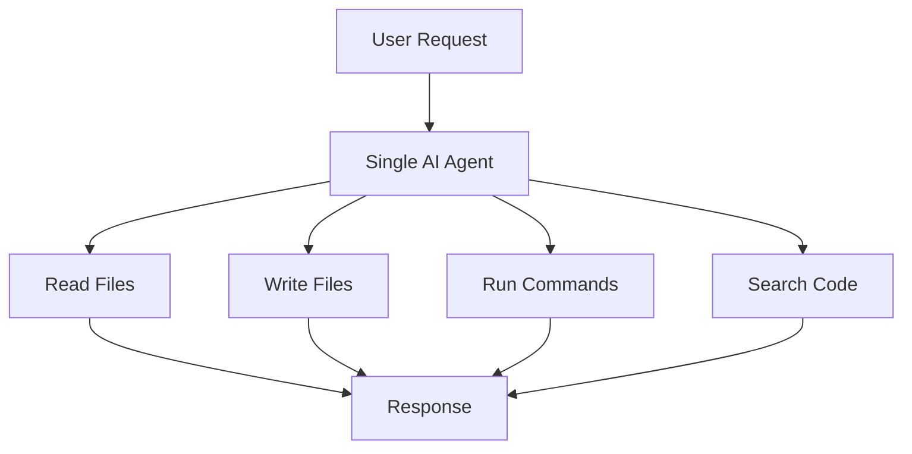
```mermaid
graph TD
    A[User Request] --> B[Single AI Agent]
    B --> C[Read Files]
    B --> D[Write Files]
    B --> E[Run Commands]
    B --> F[Search Code]
    C --> G[Response]
    D --> G
    E --> G
    F --> G
```

**Characteristics:**
- One agent does everything
- Serial execution
- Simple but slow

---

### Multi-Agent System (2024-2025)

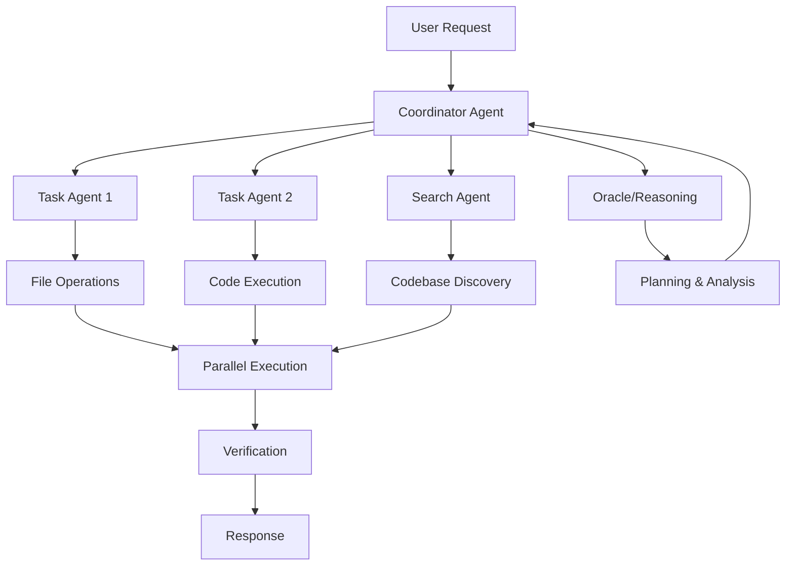
```mermaid
graph TD
    A[User Request] --> B[Coordinator Agent]
    B --> C[Task Agent 1]
    B --> D[Task Agent 2]
    B --> E[Search Agent]
    B --> F[Oracle/Reasoning]
    
    C --> G[File Operations]
    D --> H[Code Execution]
    E --> I[Codebase Discovery]
    F --> J[Planning & Analysis]
    
    G --> K[Parallel Execution]
    H --> K
    I --> K
    J --> B
    
    K --> L[Verification]
    L --> M[Response]
```

**Characteristics:**
- Specialized agents
- Parallel execution
- Oracle for deep thinking
- 3-10x faster

---

### Cursor Agent Architecture

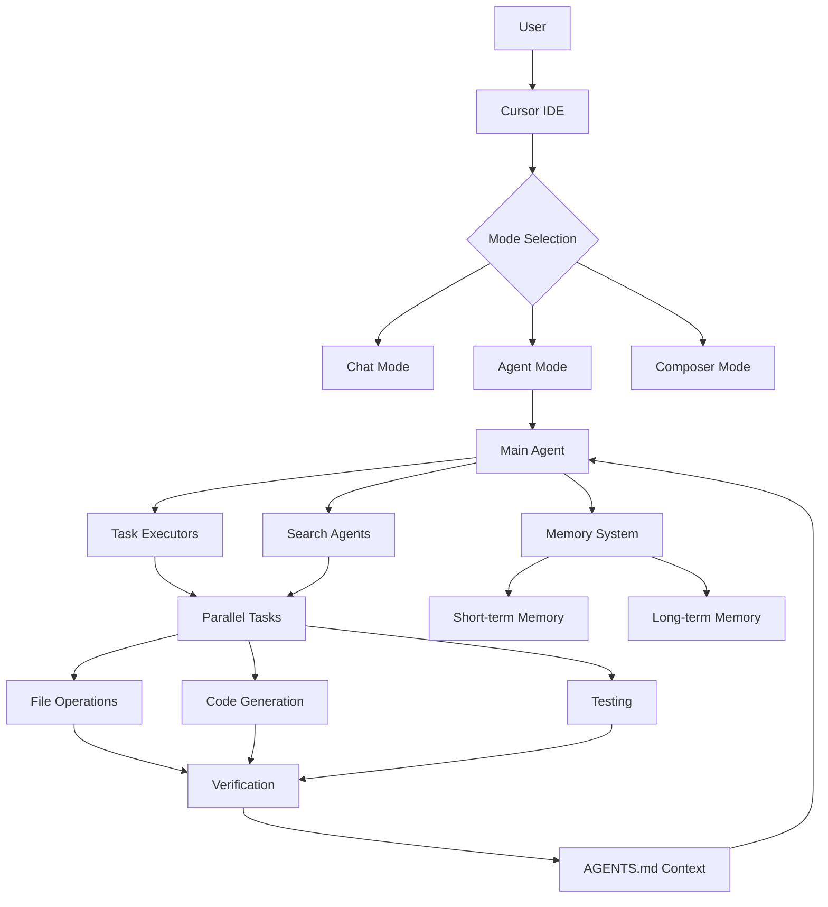
```mermaid
graph TD
    A[User] --> B[Cursor IDE]
    B --> C{Mode Selection}
    
    C --> D[Chat Mode]
    C --> E[Agent Mode]
    C --> F[Composer Mode]
    
    E --> G[Main Agent]
    G --> H[Task Executors]
    G --> I[Search Agents]
    G --> J[Memory System]
    
    H --> K[Parallel Tasks]
    I --> K
    
    K --> L[File Operations]
    K --> M[Code Generation]
    K --> N[Testing]
    
    J --> O[Short-term Memory]
    J --> P[Long-term Memory]
    
    L --> Q[Verification]
    M --> Q
    N --> Q
    
    Q --> R[AGENTS.md Context]
    R --> G
```

---

### Claude Code Architecture

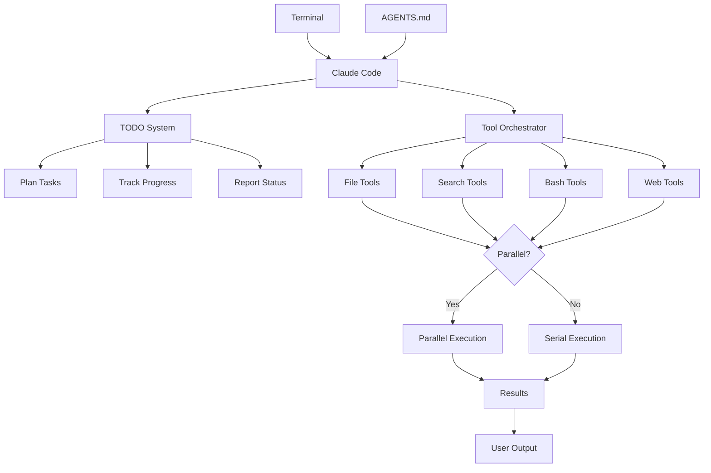
```mermaid
graph TD
    A[Terminal] --> B[Claude Code]
    B --> C[TODO System]
    B --> D[Tool Orchestrator]
    
    C --> E[Plan Tasks]
    C --> F[Track Progress]
    C --> G[Report Status]
    
    D --> H[File Tools]
    D --> I[Search Tools]
    D --> J[Bash Tools]
    D --> K[Web Tools]
    
    H --> L{Parallel?}
    I --> L
    J --> L
    K --> L
    
    L -->|Yes| M[Parallel Execution]
    L -->|No| N[Serial Execution]
    
    M --> O[Results]
    N --> O
    
    O --> P[User Output]
    
    Q[AGENTS.md] --> B
```

---

### Amp Oracle Pattern

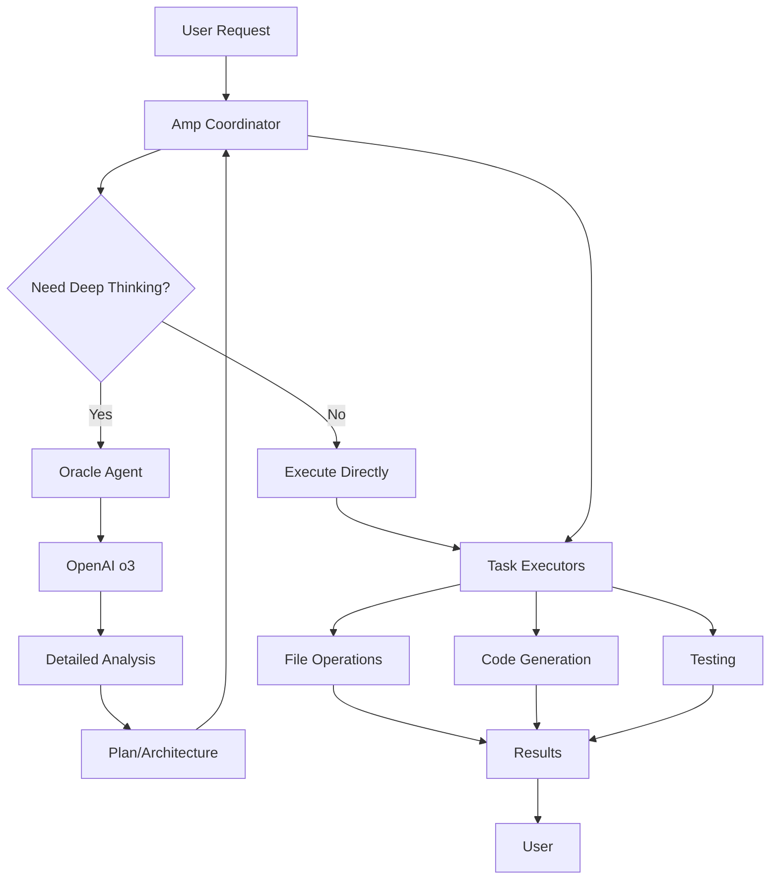
```mermaid
graph TD
    A[User Request] --> B[Amp Coordinator]
    
    B --> C{Need Deep Thinking?}
    
    C -->|Yes| D[Oracle Agent]
    C -->|No| E[Execute Directly]
    
    D --> F[OpenAI o3]
    F --> G[Detailed Analysis]
    G --> H[Plan/Architecture]
    H --> B
    
    E --> I[Task Executors]
    B --> I
    
    I --> J[File Operations]
    I --> K[Code Generation]
    I --> L[Testing]
    
    J --> M[Results]
    K --> M
    L --> M
    
    M --> N[User]
```

---

## ⏱️ Tool Evolution Timeline

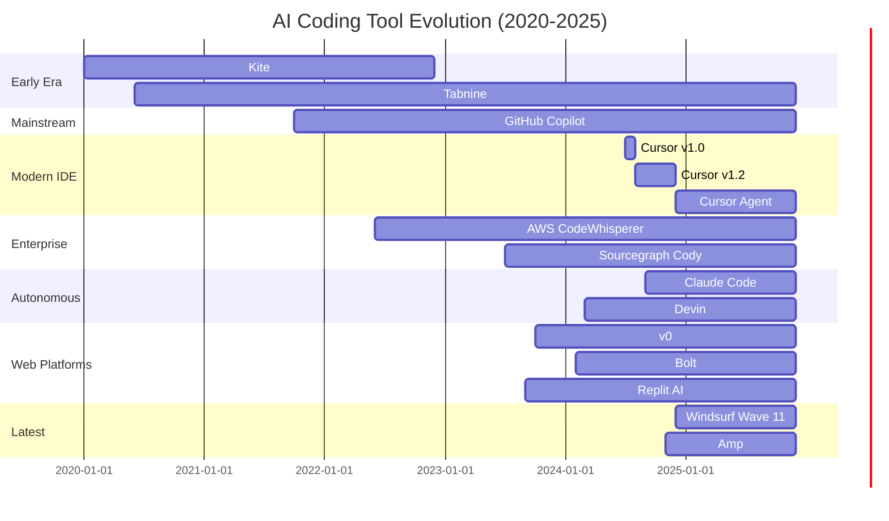
```mermaid
gantt
    title AI Coding Tool Evolution (2020-2025)
    dateFormat YYYY-MM
    section Early Era
    Kite                :2020-01, 2022-12
    Tabnine             :2020-06, 2025-12
    section Mainstream
    GitHub Copilot      :2021-10, 2025-12
    section Modern IDE
    Cursor v1.0         :2024-07, 2024-08
    Cursor v1.2         :2024-08, 2024-12
    Cursor Agent        :2024-12, 2025-12
    section Enterprise
    AWS CodeWhisperer   :2022-06, 2025-12
    Sourcegraph Cody    :2023-07, 2025-12
    section Autonomous
    Claude Code         :2024-09, 2025-12
    Devin               :2024-03, 2025-12
    section Web Platforms
    v0                  :2023-10, 2025-12
    Bolt                :2024-02, 2025-12
    Replit AI           :2023-09, 2025-12
    section Latest
    Windsurf Wave 11    :2024-12, 2025-12
    Amp                 :2024-11, 2025-12
```

---

## 🔄 Workflow Patterns

### Standard Git Workflow

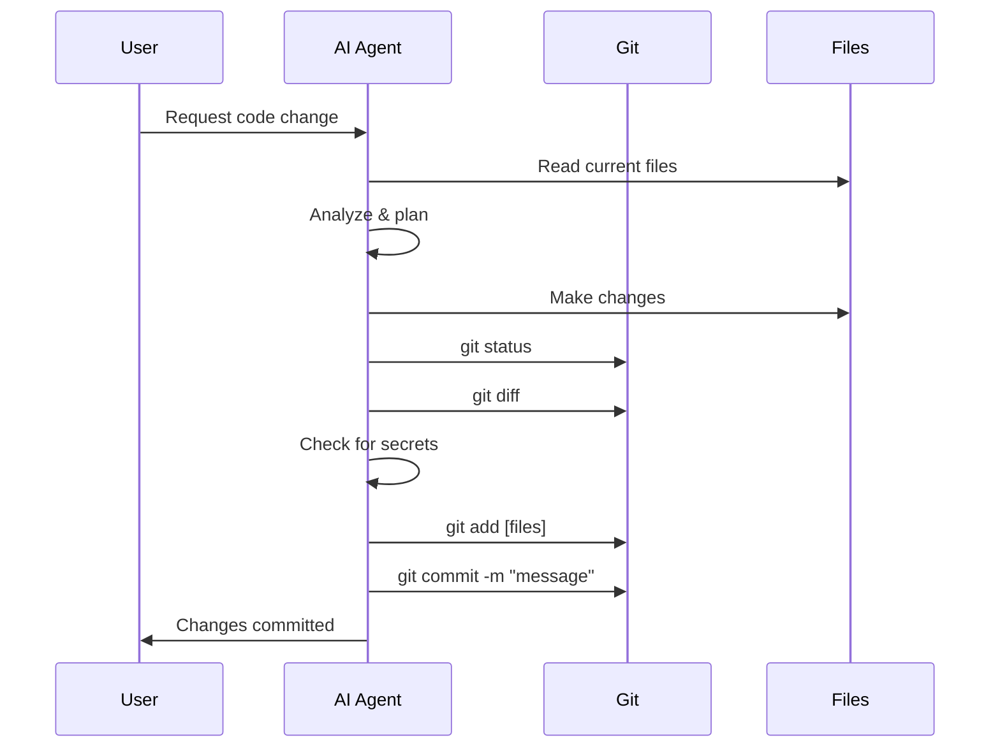
```mermaid
sequenceDiagram
    participant U as User
    participant A as AI Agent
    participant G as Git
    participant F as Files
    
    U->>A: Request code change
    A->>F: Read current files
    A->>A: Analyze & plan
    A->>F: Make changes
    A->>G: git status
    A->>G: git diff
    A->>A: Check for secrets
    A->>G: git add [files]
    A->>G: git commit -m "message"
    A->>U: Changes committed
```

---

### Parallel Task Execution

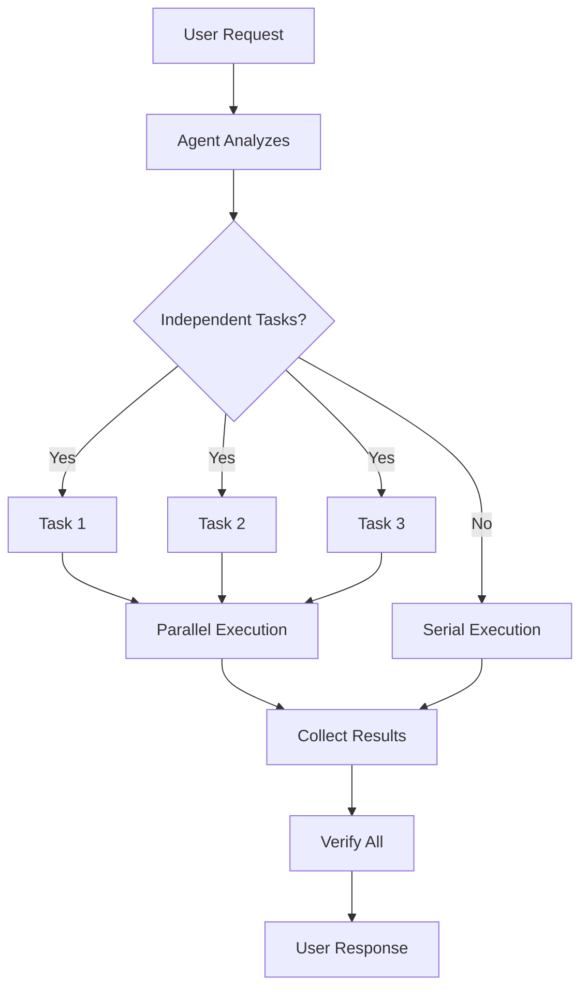
```mermaid
graph TD
    A[User Request] --> B[Agent Analyzes]
    B --> C{Independent Tasks?}
    
    C -->|Yes| D[Task 1]
    C -->|Yes| E[Task 2]
    C -->|Yes| F[Task 3]
    C -->|No| G[Serial Execution]
    
    D --> H[Parallel Execution]
    E --> H
    F --> H
    
    H --> I[Collect Results]
    G --> I
    
    I --> J[Verify All]
    J --> K[User Response]
```

---

### TODO Tracking Workflow

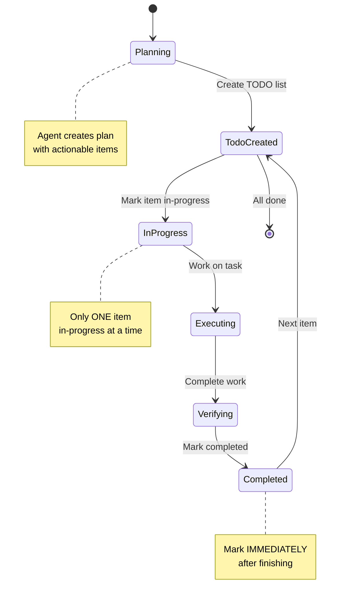
```mermaid
stateDiagram-v2
    [*] --> Planning
    Planning --> TodoCreated: Create TODO list
    TodoCreated --> InProgress: Mark item in-progress
    InProgress --> Executing: Work on task
    Executing --> Verifying: Complete work
    Verifying --> Completed: Mark completed
    Completed --> TodoCreated: Next item
    TodoCreated --> [*]: All done
    
    note right of Planning
        Agent creates plan
        with actionable items
    end note
    
    note right of InProgress
        Only ONE item
        in-progress at a time
    end note
    
    note right of Completed
        Mark IMMEDIATELY
        after finishing
    end note
```

---

## 📊 Comparison Charts

### Feature Adoption Over Time

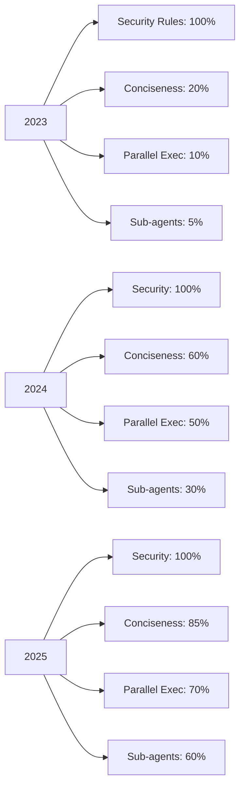
```mermaid
graph LR
    A[2023] --> B[Security Rules: 100%]
    A --> C[Conciseness: 20%]
    A --> D[Parallel Exec: 10%]
    A --> E[Sub-agents: 5%]
    
    F[2024] --> G[Security: 100%]
    F --> H[Conciseness: 60%]
    F --> I[Parallel Exec: 50%]
    F --> J[Sub-agents: 30%]
    
    K[2025] --> L[Security: 100%]
    K --> M[Conciseness: 85%]
    K --> N[Parallel Exec: 70%]
    K --> O[Sub-agents: 60%]
```

---

### Tool Type Distribution

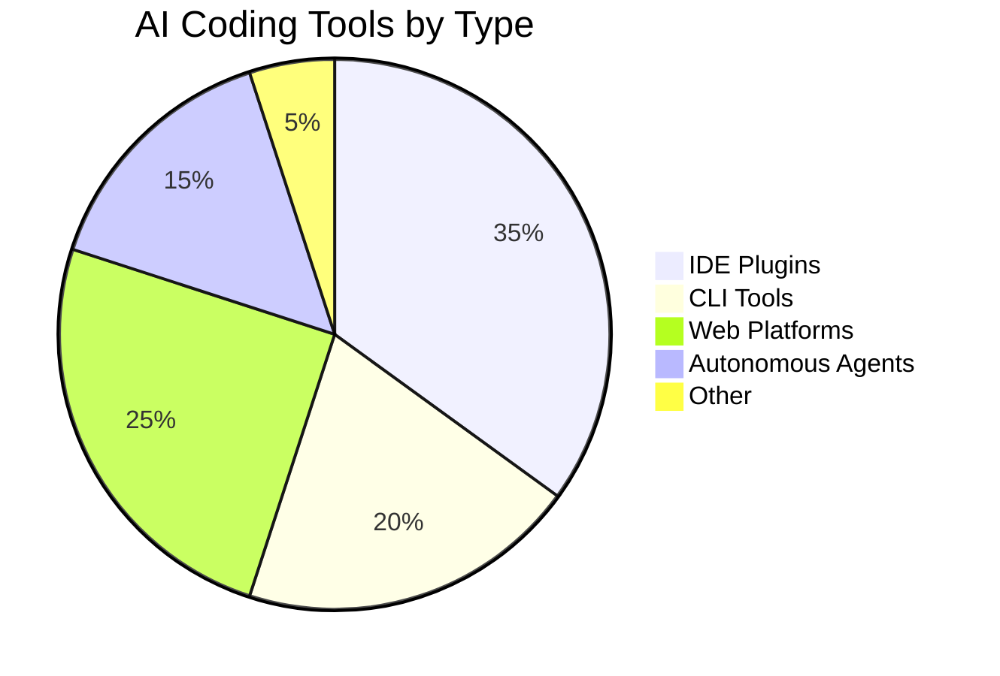
```mermaid
pie title AI Coding Tools by Type
    "IDE Plugins" : 35
    "CLI Tools" : 20
    "Web Platforms" : 25
    "Autonomous Agents" : 15
    "Other" : 5
```

---

### Pricing Distribution

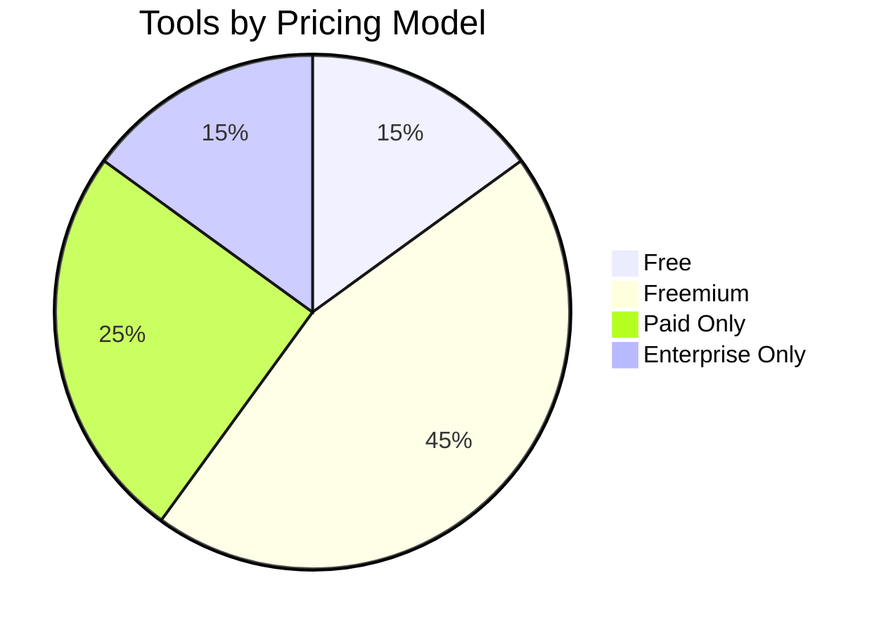
```mermaid
pie title Tools by Pricing Model
    "Free" : 15
    "Freemium" : 45
    "Paid Only" : 25
    "Enterprise Only" : 15
```

---

## 🔒 Security Flow

### Secret Detection Workflow

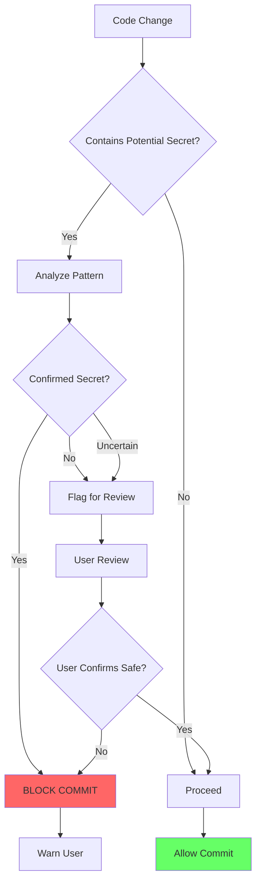
```mermaid
flowchart TD
    A[Code Change] --> B{Contains Potential Secret?}
    
    B -->|Yes| C[Analyze Pattern]
    B -->|No| D[Proceed]
    
    C --> E{Confirmed Secret?}
    
    E -->|Yes| F[BLOCK COMMIT]
    E -->|No| G[Flag for Review]
    E -->|Uncertain| G
    
    F --> H[Warn User]
    G --> I[User Review]
    
    I --> J{User Confirms Safe?}
    J -->|Yes| D
    J -->|No| F
    
    D --> K[Allow Commit]
    
    style F fill:#f66
    style K fill:#6f6
```

---

### Security Validation Chain

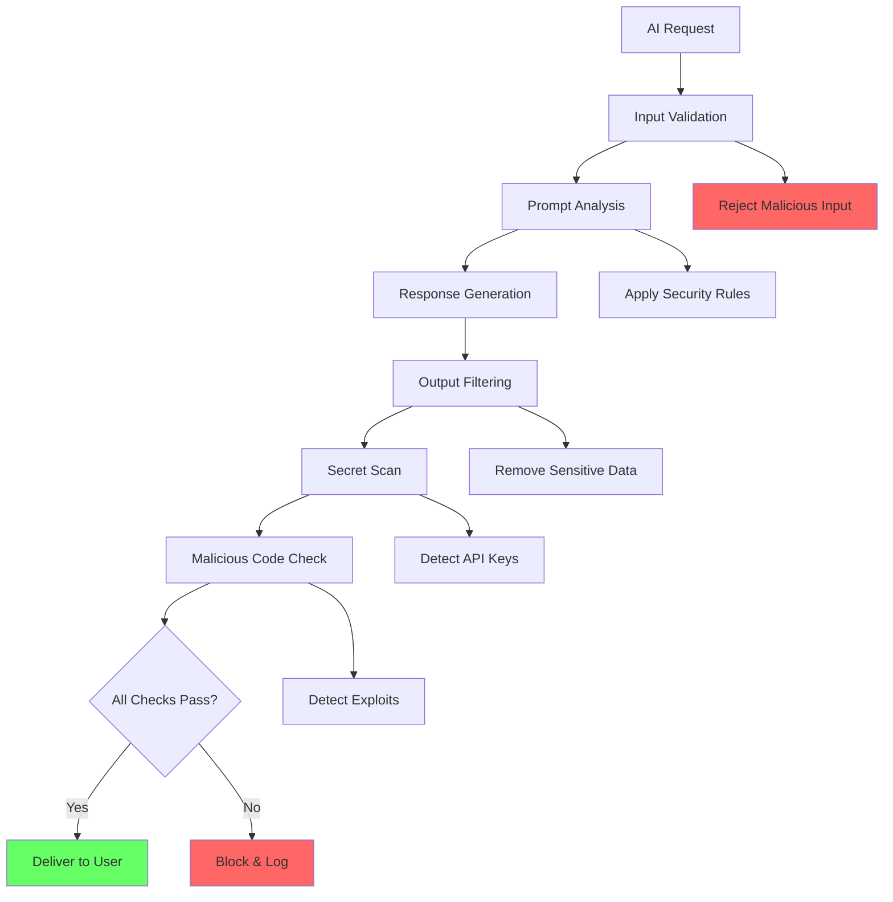
```mermaid
graph TD
    A[AI Request] --> B[Input Validation]
    B --> C[Prompt Analysis]
    C --> D[Response Generation]
    D --> E[Output Filtering]
    E --> F[Secret Scan]
    F --> G[Malicious Code Check]
    G --> H{All Checks Pass?}
    
    H -->|Yes| I[Deliver to User]
    H -->|No| J[Block & Log]
    
    B --> K[Reject Malicious Input]
    C --> L[Apply Security Rules]
    E --> M[Remove Sensitive Data]
    F --> N[Detect API Keys]
    G --> O[Detect Exploits]
    
    style I fill:#6f6
    style J fill:#f66
    style K fill:#f66
```

---

## 🎯 User Journey Maps

### First-Time User Journey

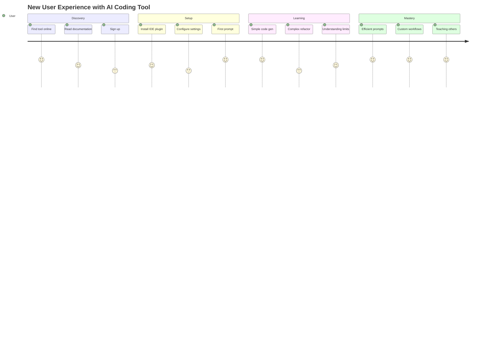
```mermaid
journey
    title New User Experience with AI Coding Tool
    section Discovery
      Find tool online: 5: User
      Read documentation: 4: User
      Sign up: 3: User
    section Setup
      Install IDE plugin: 4: User
      Configure settings: 3: User
      First prompt: 5: User
    section Learning
      Simple code gen: 5: User
      Complex refactor: 3: User
      Understanding limits: 4: User
    section Mastery
      Efficient prompts: 5: User
      Custom workflows: 5: User
      Teaching others: 5: User
```

---

## 📐 Architecture Comparison

### Simple vs. Advanced Tools

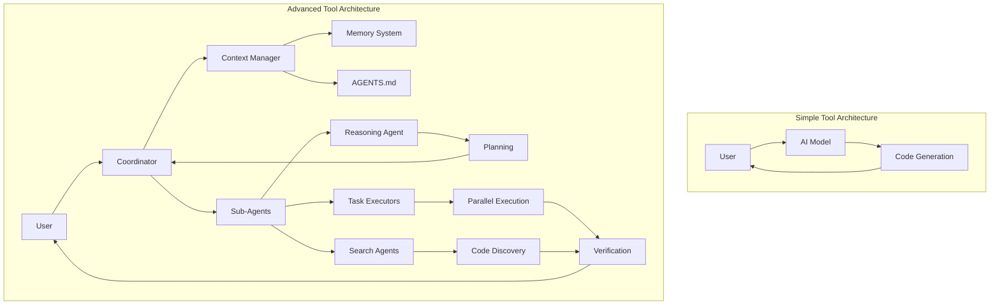
```mermaid
graph TB
    subgraph Simple[Simple Tool Architecture]
        S1[User] --> S2[AI Model]
        S2 --> S3[Code Generation]
        S3 --> S1
    end
    
    subgraph Advanced[Advanced Tool Architecture]
        A1[User] --> A2[Coordinator]
        A2 --> A3[Context Manager]
        A2 --> A4[Sub-Agents]
        A3 --> A5[Memory System]
        A3 --> A6[AGENTS.md]
        A4 --> A7[Reasoning Agent]
        A4 --> A8[Task Executors]
        A4 --> A9[Search Agents]
        A7 --> A10[Planning]
        A8 --> A11[Parallel Execution]
        A9 --> A12[Code Discovery]
        A10 --> A2
        A11 --> A13[Verification]
        A12 --> A13
        A13 --> A1
    end
```

---

## 🔄 Evolution of Conciseness

### Response Length Evolution

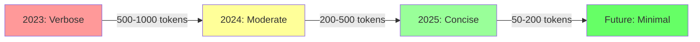
```mermaid
graph LR
    A[2023: Verbose] -->|500-1000 tokens| B[2024: Moderate]
    B -->|200-500 tokens| C[2025: Concise]
    C -->|50-200 tokens| D[Future: Minimal]
    
    style A fill:#f99
    style B fill:#ff9
    style C fill:#9f9
    style D fill:#6f6
```

---

## 📊 Pattern Adoption Heatmap

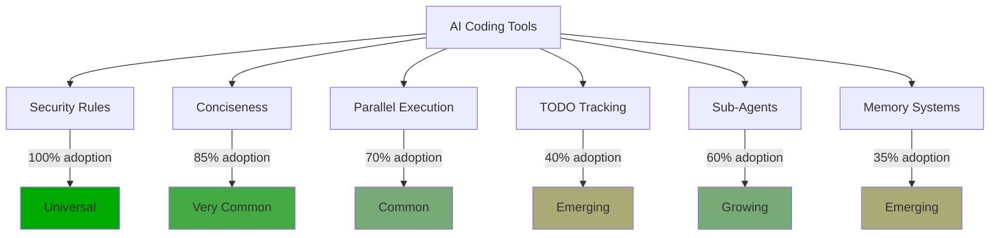
```mermaid
graph TD
    A[AI Coding Tools] --> B[Security Rules]
    A --> C[Conciseness]
    A --> D[Parallel Execution]
    A --> E[TODO Tracking]
    A --> F[Sub-Agents]
    A --> G[Memory Systems]
    
    B -->|100% adoption| B1[Universal]
    C -->|85% adoption| C1[Very Common]
    D -->|70% adoption| D1[Common]
    E -->|40% adoption| E1[Emerging]
    F -->|60% adoption| F1[Growing]
    G -->|35% adoption| G1[Emerging]
    
    style B1 fill:#0a0
    style C1 fill:#4a4
    style D1 fill:#7a7
    style E1 fill:#aa7
    style F1 fill:#7a7
    style G1 fill:#aa7
```

---

## 🎨 Tool Categorization

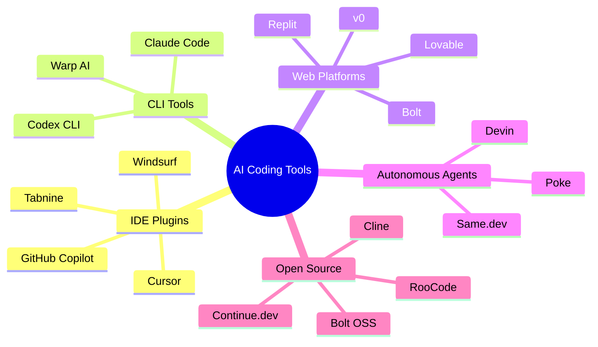
```mermaid
mindmap
  root((AI Coding Tools))
    IDE Plugins
      Cursor
      GitHub Copilot
      Tabnine
      Windsurf
    CLI Tools
      Claude Code
      Warp AI
      Codex CLI
    Web Platforms
      v0
      Bolt
      Replit
      Lovable
    Autonomous Agents
      Devin
      Poke
      Same.dev
    Open Source
      Cline
      RooCode
      Continue.dev
      Bolt OSS
```

---

## 📈 Market Share Visualization

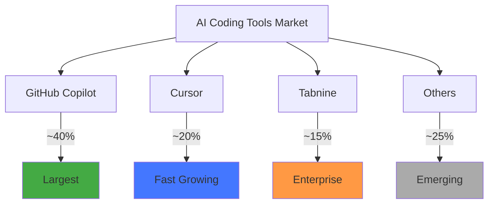
```mermaid
graph TD
    A[AI Coding Tools Market] --> B[GitHub Copilot]
    A --> C[Cursor]
    A --> D[Tabnine]
    A --> E[Others]
    
    B -->|~40%| F[Largest]
    C -->|~20%| G[Fast Growing]
    D -->|~15%| H[Enterprise]
    E -->|~25%| I[Emerging]
    
    style F fill:#4a4
    style G fill:#47f
    style H fill:#f94
    style I fill:#aaa
```

---

## 🔍 Decision Tree Visualization

```mermaid
graph TD
    A[Choose AI Tool] --> B{Budget?}
    
    B -->|Free| C[GitHub Copilot Free]
    B -->|$20/mo| D[Cursor / Claude Code]
    B -->|Enterprise| E[Tabnine Enterprise]
    
    C --> F{Use Case?}
    D --> G{Environment?}
    E --> H{Privacy Required?}
    
    F -->|Simple| I[Copilot]
    F -->|Complex| J[Cline OSS]
    
    G -->|IDE| K[Cursor]
    G -->|Terminal| L[Claude Code]
    
    H -->|Yes| M[Tabnine Private]
    H -->|No| N[Sourcegraph Cody]
    
    style I fill:#9f9
    style J fill:#9f9
    style K fill:#9f9
    style L fill:#9f9
    style M fill:#9f9
    style N fill:#9f9
```

---

## 📝 Notes on Diagrams

### How to View:
1. **GitHub:** Renders Mermaid automatically
2. **VS Code:** Use "Markdown Preview Enhanced" extension
3. **Online:** Copy to https://mermaid.live

### Customization:
All diagrams use Mermaid syntax and can be:
- Modified for specific needs
- Exported as images
- Embedded in presentations
- Used in documentation

---

## 🎯 Future Additions

Planned visual documentation:
- [ ] Performance comparison charts
- [ ] Token usage over time
- [ ] Model capability matrix
- [ ] Integration ecosystem map
- [ ] Community growth graphs

---

*Last Updated: 2025-01-02*  
*Diagrams created with Mermaid*  
*Contributions welcome!*
