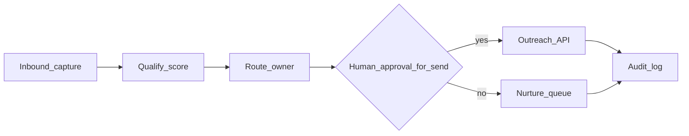

# محرك إيراد آلي (حدود واقعية + تنفيذ كامل)

«محرك إيراد آلي» هنا يعني: **تسلسلًا مُهيكلًا** من التقاط الاهتمام → التأهيل → جدولة → متابعة، مع **بوابات بشرية** حيث القانون أو المخاطرة يقتضيان ذلك — وليس إرسالًا جماعيًا بلا رقابة في السعودية أو أي سوق خاضع لـ PDPL/اشتراك.

---

## 1) المبادئ (غير قابلة للتفاوض)

1. **الموافقة والاشتراك:** لا رسائل بلا opt-in حيث يلزم القانون.  
2. **PDPL:** أي مسار يعرّض بيانات شركة/أشخاص يمرّ بتصنيف وحقول حوكمة — انظر [`proposals.py`](../salesflow-saas/backend/app/api/v1/proposals.py) و[`pdpl-nca-ai-control-matrices.md`](governance/pdpl-nca-ai-control-matrices.md).  
3. **الحد من الإزعاج:** حدود يومية/أسبوعية + قائمة عدم الاتصال.  
4. **أثر قابل للقياس:** كل خطوة تُسجَّل (CRM أو جدول) لربط الإنفاق بالإيراد لاحقًا.

---

## 2) مخطط التدفق (منطقي)

---

## 3) مصادر الإدخال (Capture)

| المصدر | تنفيذ |
|--------|--------|
| نماذج ويب / landing | توجيه إلى CRM أو جدول leads مع timestamp ومصدر |
| استيراد قائمة | تنظيف + إزالة تكرار + **عدم** إرسال لمن لم يوافق |
| حدث يدوي (معرض، مكالمة) | تسجيل في نفس النموذج |

---

## 4) التأهيل (Qualify)

* استخدام حقول Lead (حجم، قطاع، نضج شراكة) إن وُجدت في النموذج.
* عتبة: فقط من يمرّ بعتبة الدخول إلى **قائمة اتصال بشري** أو إلى **قالب رسالة معتمد**.

---

## 5) التنفيذ الآلي المسموح (Outreach API)

الكود المرجعي: [`outreach_engine.py`](../salesflow-saas/backend/app/api/v1/outreach_engine.py) — مسارات مثل:

* `POST .../outreach-engine/send`  
* `POST .../outreach-engine/campaign/launch`  
* `GET .../outreach-engine/log`

**قاعدة:** أي إرسال جماعي يمرّ بـ:

1. مراجعة نص القالب (إصدار ثابت).  
2. حد أعلى لعدد المستلمين لكل دفعة.  
3. تسجيل النتيجة في `log` / مراقبة.

---

## 6) البوابة البشرية (Human-in-the-loop)

قبل أول إرسال لقائمة جديدة:

* موافقة داخلية (Slack/email مسجّل) **أو** موافقة Class B حيث السياسة تفرض ذلك على «التزام خارجي».

---

## 7) المتابعة (Cadence)

| بعد الإرسال | فعل |
|-------------|-----|
| يوم 2 | متابعة قصيرة |
| يوم 5 | قيمة إضافية (رابط case أو مقياس) |
| يوم 10 | إغلاق المحاولة أو تحويل لـ nurture |

استخدم نفس النصوص المرجعية في [`FIRST_THREE_CLIENTS_PLAN_AR.md`](FIRST_THREE_CLIENTS_PLAN_AR.md).

---

## 8) القياس (Funnel)

1. Lead captured  
2. Qualified  
3. Meeting booked  
4. Pilot offered  
5. Pilot signed  
6. Paid  

اربط كل مرحلة بمصدر حقيقة (CRM field أو log id).

---

## 9) ما لا يُسمى «أتمتة» هنا

* شراء قوائم بريدية غير موافَق عليها.  
* إرسال مخفي عبر قنوات تخرق سياسة المنصة.  
* «AI يغلق الصفقة» بدون إنسان — خارج النطاق التشغيلي الآمن.

---

## 10) التوسع التقني (لاحقًا)

* Webhooks من نماذج إلى طابور (queue) ثم عامل workers — عند الحاجة للحجم.  
* مزامنة ثنائية مع CRM — بعد أول عميل مدفوع.

---

*هذا المستند يحدّ السلوك الآمن والقابل للقياس؛ يلتزم فريق المنتج والقانون بتعديله عند تغيير السياسات.*
