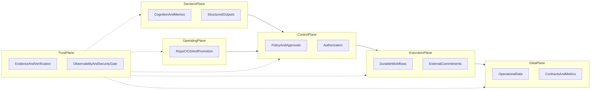

# AI operating model — decision, execution, control, data, trust, operating

This repository follows the **Master Operating Prompt** ([`MASTER_OPERATING_PROMPT.md`](../MASTER_OPERATING_PROMPT.md)): a governed hybrid stack, not “agents only.”

**Dealix six tracks** (Revenue, Partnership, CorpDev/M&A, Expansion, PMI, Trust & exec): [`dealix-six-tracks.md`](dealix-six-tracks.md).

## Governance library (full index)

| Document | Purpose |
|----------|---------|
| [governance/README.md](governance/README.md) | Table of all governance topics |
| [governance/planes-and-runtime.md](governance/planes-and-runtime.md) | Five planes, three layers, runtime choice |
| [governance/approval-policy.md](governance/approval-policy.md) | A / R / S, actors, Class A/B/C, evidence packs |
| [governance/events-and-schema.md](governance/events-and-schema.md) | Events, JSON Schema, AsyncAPI, versioning |
| [governance/trust-fabric.md](governance/trust-fabric.md) | Trust substrate, tool verification, security gate |
| [governance/connectors-and-data-plane.md](governance/connectors-and-data-plane.md) | Facades, data plane, semantic metrics |
| [governance/github-and-release.md](governance/github-and-release.md) | Branch rules, CI, environments, OIDC |
| [governance/design-and-arabic.md](governance/design-and-arabic.md) | Design system, RTL, Arabic-first |
| [governance/discovery-and-output-checklist.md](governance/discovery-and-output-checklist.md) | Discovery, phasing, 20-point report, Arabic bootstrap |
| [governance/strategic-ops-pmi.md](governance/strategic-ops-pmi.md) | M&A, PMI, strategic ops |
| [governance/execution-fabric.md](governance/execution-fabric.md) | Celery/LangGraph today vs Temporal target (Tier-1) |
| [governance/technology-radar-tier1.md](governance/technology-radar-tier1.md) | Official vs optional vs pilot stack |
| [governance/saudi-compliance-and-ai-governance.md](governance/saudi-compliance-and-ai-governance.md) | PDPL posture, NCA readiness, NIST/OWASP alignment |
| [execution-matrix-90d-tier1.md](execution-matrix-90d-tier1.md) | Phase 0–1 outcomes vs agent matrix |
| [blueprint-master-architecture.md](blueprint-master-architecture.md) | Master blueprint index |

## Planes at a glance

| Plane | Owns | Must not |
|-------|------|-----------|
| **Decision** | Analysis, memos, structured recommendations, scenarios | Durable external commitments as narration-only |
| **Execution** | Workflows, retries, idempotency, compensation, side effects | Unstructured “trust me” execution |
| **Control** | Policy, approvals, RBAC, secrets, promotion, audit | Ad-hoc rules only in prompts |
| **Data** | Operational truth, contracts, metrics definitions, lineage | Duplicate conflicting metric meanings |
| **Trust** | Evidence packs, tool verification, security gate, evals | Claims without proof |
| **Operating** (Tier-1 naming) | Repo-native discipline, CI/CD, branch/env governance, SDLC, delivery evidence | “Control on paper” without pipeline and audit trail |

**Operating** extends **Control** into how changes ship: see [planes-and-runtime.md — Operating plane](governance/planes-and-runtime.md#operating-plane-tier-1-naming).

## Flow (conceptual)

Trust wraps every plane: verification, audit, telemetry, and gates apply to cognition outputs, policy decisions, workflow steps, data mutations, and **operating** evidence (CI, merges, deployments).

## Starting path by product type

Sequence explicitly when multiple rows apply; do not mix chaotically.

| Product shape | Prioritize first | Deep dive |
|---------------|------------------|-----------|
| **SaaS** | Auth, billing, admin, analytics, onboarding, release | [github-and-release.md](governance/github-and-release.md), [connectors-and-data-plane.md](governance/connectors-and-data-plane.md) |
| **AI / agentic** | Provider routing, memory, orchestration, tool verification, evals, observability | [planes-and-runtime.md](governance/planes-and-runtime.md), [trust-fabric.md](governance/trust-fabric.md) |
| **CRM / lead / ops** | Workflow safety, approvals, messaging, audit, connector facades | [approval-policy.md](governance/approval-policy.md), [events-and-schema.md](governance/events-and-schema.md) |
| **Strategic / corpdev** | Contracts, evidence packs, deterministic workflows, executive views | [strategic-ops-pmi.md](governance/strategic-ops-pmi.md), [discovery-and-output-checklist.md](governance/discovery-and-output-checklist.md) |

**Dealix** spans SaaS, agentic, CRM, and strategic modules — pick the dominant thread for the current milestone, then pull in cross-cutting trust and GitHub rules.

## Dealix implementation pointers

- **Agents / routing / pipeline:** [`salesflow-saas/backend/app/services/agents/`](../salesflow-saas/backend/app/services/agents/) — `router.py`, `executor.py`, `autonomous_pipeline.py`.
- **Prompts (runtime path):** [`salesflow-saas/ai-agents/prompts/`](../salesflow-saas/ai-agents/prompts/) — loaded by `AgentExecutor` (`PROMPTS_DIR`); policy stays in code/services, not inside markdown prompts.
- **Core OS (memos / governance direction):** [`salesflow-saas/backend/app/services/core_os/`](../salesflow-saas/backend/app/services/core_os/).
- **Launch & evidence discipline:** [`salesflow-saas/docs/LAUNCH_CHECKLIST.md`](../salesflow-saas/docs/LAUNCH_CHECKLIST.md), [`salesflow-saas/verify-launch.ps1`](../salesflow-saas/verify-launch.ps1).

## Operating sequence for any major change

1. Repository discovery (architecture + capability + gap + risk + trust). See [governance/discovery-and-output-checklist.md](governance/discovery-and-output-checklist.md).  
2. Smallest phase that proves value with tests and rollback.  
3. Evidence: tests, logs, or contract checks — as defined in the phase.  
4. Only then expand scope.

Primary policy reference: [governance/approval-policy.md](governance/approval-policy.md).
