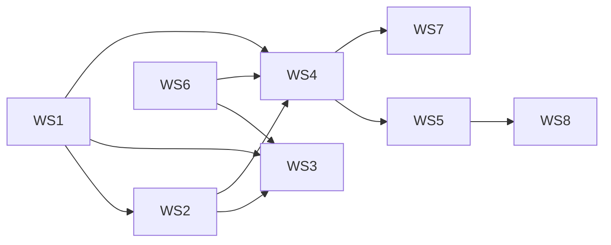

# Dealix Completion Program — workstreams (execution matrix)

**Goal:** Close the gap between Tier-1 **documentation** and **enterprise-grade runtime** (Decision + Execution + Trust + Data + Operating fabrics).  
**Priority order:** Trust/Control → Execution durability → Connector facades → Semantic metrics → Saudi governance → Executive surfaces.

**Living registers:** [`architecture-register.md`](architecture-register.md) (subsystem status), [`adr/0002-execution-matrix-canonical-source.md`](adr/0002-execution-matrix-canonical-source.md) (matrix source of truth).

**PR #16 closure bundle (merged):** [`salesflow-saas/docs/tier1-master-closure-checklist.md`](../salesflow-saas/docs/tier1-master-closure-checklist.md) (50-item master gates) + supporting tracks under [`salesflow-saas/docs/`](../salesflow-saas/docs/) and [`salesflow-saas/docs/governance/`](../salesflow-saas/docs/governance/) — use alongside this index; prefer **one** status column between the register and the master checklist to avoid drift.  
**Arabic master index (15 sections):** [`TIER1_MASTER_CLOSURE_CHECKLIST_AR.md`](TIER1_MASTER_CLOSURE_CHECKLIST_AR.md).

| WS | Name | SLA (target) | Primary deliverable docs / code |
|----|------|--------------|-----------------------------------|
| WS1 | Architecture closure | 2–3 wk | This file + register + ADR 0002; banner on [`Execution_Matrix_v2.md`](../Execution_Matrix_v2.md) |
| WS2 | Decision plane hardening | 2–4 wk | [`decision_plane_contracts.py`](../salesflow-saas/backend/app/services/core_os/decision_plane_contracts.py) + [`decision_memo.py`](../salesflow-saas/backend/app/services/core_os/decision_memo.py); enforce on Class B routes incrementally |
| WS3 | Execution plane hardening | 4–8 wk | [`workflows-inventory.md`](workflows-inventory.md), [`temporal-pilot-scope.md`](temporal-pilot-scope.md), [`adr/0001-tier1-execution-policy-spikes.md`](adr/0001-tier1-execution-policy-spikes.md) |
| WS4 | Trust fabric hardening | 4–8 wk | [`trust/tool-verification-ledger-v1-completion.md`](trust/tool-verification-ledger-v1-completion.md), [`verification_ledger.py`](../salesflow-saas/backend/app/services/core_os/verification_ledger.py) |
| WS5 | Data & connector fabric | 4–8 wk | [`ws5-connector-events-metrics.md`](ws5-connector-events-metrics.md), [`semantic-metrics-dictionary.md`](semantic-metrics-dictionary.md), [`lineage-catalog-choice.md`](lineage-catalog-choice.md) |
| WS6 | Enterprise delivery fabric | 2–4 wk | [`github-enterprise-delivery-completion.md`](github-enterprise-delivery-completion.md) |
| WS7 | Saudi enterprise readiness | 2–4 wk | [`governance/pdpl-nca-ai-control-matrices.md`](governance/pdpl-nca-ai-control-matrices.md) + [`saudi-compliance-and-ai-governance.md`](governance/saudi-compliance-and-ai-governance.md) |
| WS8 | Executive & customer readiness | 3–6 wk | [`executive-room-completion-spec.md`](executive-room-completion-spec.md) |

## Per-workstream contract (fill in owners / PRs / dates in your PM tool)

Use columns: **Workstream → Deliverables → Owner → Evidence Gate → Exit Criteria → Dependencies → Risk → SLA**.

Detailed field tables are preserved in the approved plan document in `.cursor/plans/` (do not duplicate full prose here); this file is the **repo execution index**.

## Definition of Done (recap)

Enterprise-grade when, with evidence: structured critical recommendations; durable long workflows where required; A/R/S on sensitive actions; versioned connector facades; GitHub/OIDC release discipline; OTel-style traceability on critical paths; OWASP/NIST-aligned checks on LLM surfaces; Saudi control matrices tied to releases.

## Dependency diagram

